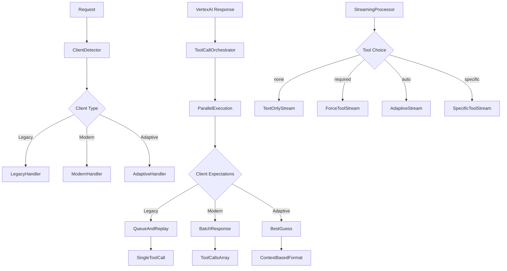

# Client Detection and Adaptive Tool Calling Implementation

## Key Findings from Documentation Analysis

Based on the streaming overview and tool rules documentation, plus the current request models, I've identified the critical implementation requirements:

### OpenAI Behavior Detection Matrix

| Detection Signal | Client Type | Tool Format | Execution Mode | Streaming Behavior |
|------------------|-------------|-------------|----------------|-------------------|
| `functions` parameter present (no `tools`) | Legacy OpenAI | `function_call` | Sequential only | Stops at call, new request needed |
| `tools` + no `parallel_tool_calls` | Transitional | `tool_calls` array | Sequential | Stops at array, single follow-up |
| `tools` + `parallel_tool_calls: true` | Modern OpenAI | `tool_calls` array | Parallel allowed | Stops at array, batch results |
| `tool_choice` object format | Modern OpenAI | `tool_calls` array | Based on parallel flag | Modern streaming |
| User-Agent contains "openai-python/1.x" | Version-based | Depends on version | Depends on version | Version-specific |

### Tool Choice Parameter Handling

| `tool_choice` Value | Behavior Required | Implementation Strategy |
|-------------------|------------------|------------------------|
| `"auto"` (default) | Model decides | Let Claude choose, convert format based on client |
| `"none"` | No tools allowed | Strip tools from Vertex request, text-only |
| `"required"` | Must use ≥1 tool | Force tool usage, error if none called |
| `{"type": "function", "function": {"name": "X"}}` | Must use specific tool | Force specific tool, error if not available |

## Critical Implementation Requirements

### 1. Request Analysis Enhancement
The current `ChatCompletionRequest` already has the parameters we need:
- ✅ `tool_choice: Option<serde_json::Value>`
- ✅ `parallel_tool_calls: Option<bool>`
- ✅ `tools: Option<Vec<ToolDefinition>>`
- ✅ `functions: Option<Vec<FunctionDefinition>>` (legacy)

**Need to add**: Client capability detection logic

### 2. Streaming Behavior Adaptation
From the documentation, the key insight is:
- **Legacy clients**: Expect stream to stop at `function_call`, resume after result
- **Modern clients**: Expect stream to stop at `tool_calls` array, single continuation
- **Claude/Vertex**: Can stream text before tool calls, then pause

**Our current implementation needs**: Adaptive streaming termination

### 3. Tool Execution Strategy
Based on the research:
- **Internal Parallel Execution**: Always execute Claude's batch calls in parallel for performance
- **External Presentation**: Adapt to client expectations (sequential vs batch)
- **Queue System**: For legacy clients, queue remaining calls from Claude batches

## Implementation Architecture



## Detection Logic Implementation

### 1. Client Capability Detection
```rust
pub fn detect_client_capabilities(
    request: &ChatCompletionRequest,
    headers: &HeaderMap,
) -> ClientCapabilities {
    let mut capabilities = ClientCapabilities::default();
    
    // Check for legacy indicators
    if request.functions.is_some() && request.tools.is_none() {
        capabilities.tool_format = ToolFormat::Legacy;
        capabilities.supports_parallel = false;
        return capabilities;
    }
    
    // Check for modern indicators
    if let Some(parallel) = request.parallel_tool_calls {
        capabilities.supports_parallel = parallel;
        capabilities.tool_format = ToolFormat::Modern;
    }
    
    // Check tool_choice format
    if let Some(tool_choice) = &request.tool_choice {
        if tool_choice.is_object() {
            capabilities.tool_format = ToolFormat::Modern;
        }
    }
    
    // User-Agent analysis
    if let Some(user_agent) = headers.get("user-agent") {
        capabilities.sdk_version = parse_sdk_version(user_agent);
    }
    
    capabilities
}
```

### 2. Tool Choice Strategy Implementation
```rust
pub enum ToolChoiceStrategy {
    Auto,
    None,
    Required,
    Specific { name: String },
}

impl ToolChoiceStrategy {
    pub fn from_request(request: &ChatCompletionRequest) -> Result<Self> {
        match &request.tool_choice {
            None => Ok(ToolChoiceStrategy::Auto),
            Some(value) => {
                if let Some(s) = value.as_str() {
                    match s {
                        "auto" => Ok(ToolChoiceStrategy::Auto),
                        "none" => Ok(ToolChoiceStrategy::None),
                        "required" => Ok(ToolChoiceStrategy::Required),
                        _ => Err(anyhow::anyhow!("Invalid tool_choice string: {}", s))
                    }
                } else if let Some(obj) = value.as_object() {
                    if obj.get("type") == Some(&serde_json::Value::String("function".to_string())) {
                        if let Some(function) = obj.get("function") {
                            if let Some(name) = function.get("name").and_then(|n| n.as_str()) {
                                return Ok(ToolChoiceStrategy::Specific { name: name.to_string() });
                            }
                        }
                    }
                    Err(anyhow::anyhow!("Invalid tool_choice object format"))
                } else {
                    Err(anyhow::anyhow!("Invalid tool_choice type"))
                }
            }
        }
    }
}
```

### 3. Adaptive Response Formatting
```rust
pub struct AdaptiveResponseFormatter {
    client_capabilities: ClientCapabilities,
    tool_choice_strategy: ToolChoiceStrategy,
}

impl AdaptiveResponseFormatter {
    pub fn format_response(
        &self,
        tool_executions: &[ToolCallExecution],
        text_content: Option<String>,
    ) -> Result<ResponseFormat> {
        match self.tool_choice_strategy {
            ToolChoiceStrategy::None => {
                // Return text-only response, ignore any tool calls
                Ok(ResponseFormat::TextOnly(text_content.unwrap_or_default()))
            }
            ToolChoiceStrategy::Required => {
                if tool_executions.is_empty() {
                    return Err(anyhow::anyhow!("tool_choice is 'required' but no tools were called"));
                }
                self.format_tool_response(tool_executions)
            }
            ToolChoiceStrategy::Specific { name } => {
                let specific_execution = tool_executions.iter()
                    .find(|e| e.name == name)
                    .ok_or_else(|| anyhow::anyhow!("Required tool '{}' was not called", name))?;
                self.format_specific_tool_response(specific_execution)
            }
            ToolChoiceStrategy::Auto => {
                if tool_executions.is_empty() {
                    Ok(ResponseFormat::TextOnly(text_content.unwrap_or_default()))
                } else {
                    self.format_tool_response(tool_executions)
                }
            }
        }
    }
    
    fn format_tool_response(&self, executions: &[ToolCallExecution]) -> Result<ResponseFormat> {
        match self.client_capabilities.tool_format {
            ToolFormat::Legacy => {
                // Return single function_call, queue the rest
                Ok(ResponseFormat::LegacyFunctionCall(executions[0].clone()))
            }
            ToolFormat::Modern => {
                // Return tool_calls array
                Ok(ResponseFormat::ModernToolCalls(executions.to_vec()))
            }
            ToolFormat::Adaptive => {
                // Choose based on context
                if executions.len() == 1 {
                    Ok(ResponseFormat::LegacyFunctionCall(executions[0].clone()))
                } else {
                    Ok(ResponseFormat::ModernToolCalls(executions.to_vec()))
                }
            }
        }
    }
}
```

## Key Implementation Points

### 1. Backward Compatibility Priority
- **Default to legacy behavior** for unknown clients
- **Graceful degradation** when detection fails
- **No breaking changes** to existing functionality

### 2. Performance Optimization
- **Always execute in parallel internally** (as you requested)
- **Present sequentially** only when required by client
- **Queue management** for legacy multi-tool scenarios

### 3. Streaming Adaptation
- **Buffer text content** before tool calls
- **Flush text** before emitting tool call
- **Terminate stream** appropriately based on client type
- **Resume correctly** after tool results

### 4. Error Handling Enhancement
- **tool_choice: "required"** but no tools called → Error
- **tool_choice: specific** but tool not available → Error
- **tool_choice: "none"** but tools present → Strip tools
- **Malformed tool_choice** → Validation error

This plan ensures we maintain your performance optimization (parallel execution) while providing perfect OpenAI compatibility for all client types, both legacy and modern.