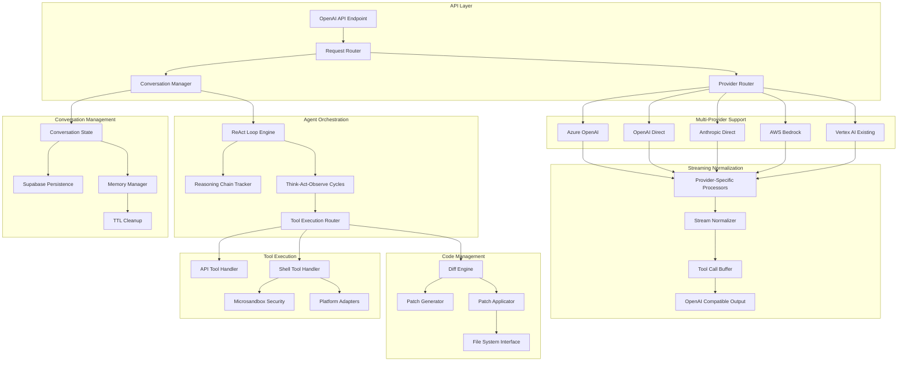

# Codex CLI Implementation Architecture

## Executive Summary

This document outlines the comprehensive technical architecture for implementing Codex CLI support in llm-supabase-rs, addressing all gaps identified in the tool calling compliance analysis while adding the core features needed for agent-based workflows.

## System Architecture Overview



## 1. Multi-Turn Conversation System

### 1.1 Data Models

```rust
#[derive(Debug, Clone, Serialize, Deserialize)]
pub struct ConversationState {
    pub conversation_id: String,
    pub previous_response_id: Option<String>,
    pub messages: Vec<ConversationMessage>,
    pub metadata: ConversationMetadata,
    pub agent_state: Option<AgentState>,
    pub created_at: DateTime<Utc>,
    pub updated_at: DateTime<Utc>,
}

#[derive(Debug, Clone, Serialize, Deserialize)]
pub struct ConversationMessage {
    pub message_id: String,
    pub role: MessageRole,
    pub content: String,
    pub tool_calls: Option<Vec<ToolCall>>,
    pub tool_call_results: Option<Vec<ToolCallResult>>,
    pub reasoning_step: Option<ReasoningStep>,
    pub timestamp: DateTime<Utc>,
}

#[derive(Debug, Clone, Serialize, Deserialize)]
pub struct ConversationMetadata {
    pub client_id: Option<String>,
    pub session_id: Option<String>,
    pub model: String,
    pub provider: String,
    pub configuration: serde_json::Value,
}
```

### 1.2 Persistence Layer

```rust
pub trait ConversationRepository {
    async fn create_conversation(&self, conversation: &ConversationState) -> Result<String>;
    async fn get_conversation(&self, id: &str) -> Result<Option<ConversationState>>;
    async fn update_conversation(&self, conversation: &ConversationState) -> Result<()>;
    async fn get_by_response_id(&self, response_id: &str) -> Result<Option<ConversationState>>;
    async fn cleanup_expired(&self, ttl: Duration) -> Result<u64>;
}
```

## 2. ReAct Loop Pattern Implementation

### 2.1 Agent State Management

```rust
#[derive(Debug, Clone, Serialize, Deserialize)]
pub struct AgentState {
    pub current_step: ReasoningStep,
    pub reasoning_chain: Vec<ReasoningStep>,
    pub goals: Vec<String>,
    pub completed_actions: Vec<CompletedAction>,
    pub next_actions: Vec<PlannedAction>,
}

#[derive(Debug, Clone, Serialize, Deserialize)]
pub enum ReasoningStep {
    Think { thought: String, analysis: String },
    Act { action: ToolCall, rationale: String },
    Observe { observation: String, evaluation: String },
}

pub struct ReActOrchestrator {
    conversation_manager: Arc<ConversationManager>,
    tool_executor: Arc<ToolExecutor>,
}

impl ReActOrchestrator {
    pub async fn execute_cycle(&self, conversation_id: &str, user_input: &str) -> Result<AgentResponse> {
        let mut conversation = self.conversation_manager.get_conversation(conversation_id).await?;
        
        loop {
            match self.determine_next_step(&conversation).await? {
                NextStep::Think => {
                    let thought = self.generate_thought(&conversation, user_input).await?;
                    conversation = self.update_conversation_with_thought(conversation, thought).await?;
                }
                NextStep::Act => {
                    let action = self.plan_action(&conversation).await?;
                    let result = self.tool_executor.execute_tool_call(&action).await?;
                    conversation = self.update_conversation_with_action(conversation, action, result).await?;
                }
                NextStep::Observe => {
                    let observation = self.generate_observation(&conversation).await?;
                    conversation = self.update_conversation_with_observation(conversation, observation).await?;
                }
                NextStep::Complete(response) => {
                    return Ok(response);
                }
            }
        }
    }
}
```

## 3. Shell-First Tool Execution

### 3.1 Security Architecture

```rust
use microsandbox::{Sandbox, SandboxConfig, ExecutionLimits};

pub struct SecureShellExecutor {
    sandbox: Sandbox,
    platform_adapter: Box<dyn PlatformAdapter>,
}

pub trait PlatformAdapter: Send + Sync {
    fn prepare_command(&self, command: &ShellCommand) -> Result<PreparedCommand>;
    fn get_security_policy(&self) -> SecurityPolicy;
    fn sanitize_output(&self, output: &str) -> String;
}

#[derive(Debug, Clone)]
pub struct SecurityPolicy {
    pub allowed_commands: Vec<String>,
    pub blocked_paths: Vec<String>,
    pub environment_restrictions: HashMap<String, String>,
    pub execution_limits: ExecutionLimits,
}

impl SecureShellExecutor {
    pub async fn execute_command(&self, command: &ShellCommand) -> Result<ExecutionResult> {
        let prepared = self.platform_adapter.prepare_command(command)?;
        
        let sandbox_config = SandboxConfig {
            limits: self.platform_adapter.get_security_policy().execution_limits,
            allowed_paths: prepared.allowed_paths,
            environment: prepared.environment,
        };
        
        let result = self.sandbox.execute_with_config(&prepared.command, sandbox_config).await?;
        
        Ok(ExecutionResult {
            stdout: self.platform_adapter.sanitize_output(&result.stdout),
            stderr: self.platform_adapter.sanitize_output(&result.stderr),
            exit_code: result.exit_code,
            duration: result.duration,
        })
    }
}
```

### 3.2 Dual-Mode Tool System

```rust
pub enum ToolExecutionMode {
    Api {
        endpoint: String,
        authentication: AuthMethod,
    },
    Shell {
        command: String,
        working_directory: Option<PathBuf>,
        environment: HashMap<String, String>,
    },
}

pub struct UnifiedToolExecutor {
    api_executor: ApiToolExecutor,
    shell_executor: SecureShellExecutor,
}

impl UnifiedToolExecutor {
    pub async fn execute_tool(&self, tool_call: &UnifiedToolCall) -> Result<ToolCallResult> {
        match &tool_call.execution_mode {
            ToolExecutionMode::Api { .. } => {
                self.api_executor.execute(tool_call).await
            }
            ToolExecutionMode::Shell { .. } => {
                self.shell_executor.execute_shell_tool(tool_call).await
            }
        }
    }
}
```

## 4. Unified Diff Support

### 4.1 Diff Engine Architecture

```rust
pub struct DiffEngine {
    patch_generator: PatchGenerator,
    patch_applicator: PatchApplicator,
    validation_engine: DiffValidationEngine,
}

pub struct UnifiedDiff {
    pub file_path: PathBuf,
    pub original_content: String,
    pub modified_content: String,
    pub hunks: Vec<DiffHunk>,
}

#[derive(Debug, Clone)]
pub struct DiffHunk {
    pub original_start: usize,
    pub original_count: usize,
    pub modified_start: usize,
    pub modified_count: usize,
    pub lines: Vec<DiffLine>,
}

impl DiffEngine {
    pub fn generate_patch(&self, original: &str, modified: &str) -> Result<UnifiedDiff> {
        let hunks = self.patch_generator.compute_hunks(original, modified)?;
        self.validation_engine.validate_diff(&hunks)?;
        
        Ok(UnifiedDiff {
            file_path: PathBuf::new(),
            original_content: original.to_string(),
            modified_content: modified.to_string(),
            hunks,
        })
    }
    
    pub async fn apply_patch(&self, patch: &UnifiedDiff, file_path: &Path) -> Result<()> {
        let current_content = tokio::fs::read_to_string(file_path).await?;
        
        if current_content != patch.original_content {
            return Err(DiffError::ContentMismatch);
        }
        
        let patched_content = self.patch_applicator.apply_hunks(&current_content, &patch.hunks)?;
        
        // Atomic write
        let temp_path = file_path.with_extension("tmp");
        tokio::fs::write(&temp_path, patched_content).await?;
        tokio::fs::rename(&temp_path, file_path).await?;
        
        Ok(())
    }
}
```

## 5. Multi-Provider Support

### 5.1 Provider Architecture

```rust
#[async_trait]
pub trait LLMProvider: Send + Sync {
    async fn chat_completion(&self, request: &ChatCompletionRequest) -> Result<ChatCompletionResponse>;
    async fn chat_completion_streaming(&self, request: &ChatCompletionRequest) -> Result<Pin<Box<dyn Stream<Item = Result<StreamChunk>> + Send>>>;
    fn supports_tools(&self) -> bool;
    fn get_streaming_behavior(&self) -> StreamingBehavior;
}

#[derive(Debug, Clone)]
pub enum StreamingBehavior {
    TokenByToken { supports_delta_tool_calls: bool },
    CompleteBlocks { buffer_until_complete: bool },
    JsonLines { parse_each_line: bool },
}

pub struct ProviderRouter {
    providers: HashMap<String, Box<dyn LLMProvider>>,
    routing_rules: RoutingRules,
}

// Provider Implementations
pub struct AzureOpenAIProvider {
    client: AzureClient,
    config: AzureConfig,
}

pub struct AnthropicDirectProvider {
    client: AnthropicClient,
    config: AnthropicConfig,
}

pub struct BedrockProvider {
    client: BedrockClient,
    config: BedrockConfig,
}
```

### 5.2 Streaming Normalization

```rust
pub struct StreamNormalizer {
    provider_processors: HashMap<String, Box<dyn StreamProcessor>>,
}

#[async_trait]
pub trait StreamProcessor: Send + Sync {
    async fn process_chunk(&mut self, chunk: &[u8]) -> Result<Vec<NormalizedChunk>>;
    async fn finalize(&mut self) -> Result<Vec<NormalizedChunk>>;
    fn get_behavior(&self) -> &StreamingBehavior;
}

pub struct OpenAIStreamProcessor {
    buffer: StreamBuffer,
    tool_call_builder: ToolCallBuilder,
}

pub struct AnthropicStreamProcessor {
    text_buffer: String,
    tool_use_buffer: Option<Value>,
    state: AnthropicStreamState,
}

pub struct BedrockStreamProcessor {
    json_line_parser: JsonLineParser,
    tool_use_accumulator: ToolUseAccumulator,
}
```

## 6. Enhanced API Request/Response Models

### 6.1 Codex CLI Extensions

```rust
#[derive(Debug, Clone, Serialize, Deserialize)]
pub struct EnhancedChatCompletionRequest {
    #[serde(flatten)]
    pub base: ChatCompletionRequest,
    
    // Codex CLI specific fields
    pub previous_response_id: Option<String>,
    pub conversation_id: Option<String>,
    pub agent_mode: Option<AgentMode>,
    pub execution_policy: Option<ExecutionPolicy>,
}

#[derive(Debug, Clone, Serialize, Deserialize)]
pub enum AgentMode {
    Direct,      // Single request-response
    ReAct,       // Think-Act-Observe loops  
    Autonomous,  // Full autonomous agent
}

#[derive(Debug, Clone, Serialize, Deserialize)]
pub struct ExecutionPolicy {
    pub max_iterations: Option<u32>,
    pub timeout_seconds: Option<u64>,
    pub allowed_tools: Option<Vec<String>>,
    pub shell_execution_allowed: bool,
    pub file_modification_allowed: bool,
}
```

## 7. Implementation Phases

### Phase 1: Foundation (Weeks 1-2)
1. Multi-turn conversation system
2. Supabase persistence layer
3. Basic ReAct orchestrator
4. Microsandbox integration research

### Phase 2: Core Features (Weeks 3-4)
1. Shell execution with security
2. Unified diff engine
3. Azure OpenAI provider
4. Enhanced streaming infrastructure

### Phase 3: Provider Compliance (Weeks 5-6)
1. OpenAI Direct provider
2. Anthropic Direct provider  
3. AWS Bedrock provider
4. Streaming normalization fixes

### Phase 4: Performance & Polish (Weeks 7-8)
1. Security enhancements
2. Performance optimizations
3. Comprehensive testing
4. Documentation and migration guides

## 8. Integration Points

### 8.1 Existing Codebase Integration
- Extend current [`ChatCompletionRequest`](src/models/request.rs) with Codex fields
- Enhance [`ToolCallManager`](src/infrastructure/common/tools.rs) for ReAct integration
- Build on existing Vertex AI patterns for new providers
- Extend streaming infrastructure in [`chat.rs`](src/api/handlers/chat.rs)

### 8.2 Database Schema
```sql
-- Conversations table
CREATE TABLE conversations (
    id UUID PRIMARY KEY,
    previous_response_id UUID REFERENCES conversations(id),
    client_id TEXT,
    session_id TEXT,
    metadata JSONB NOT NULL,
    agent_state JSONB,
    created_at TIMESTAMPTZ DEFAULT NOW(),
    updated_at TIMESTAMPTZ DEFAULT NOW()
);

-- Messages table  
CREATE TABLE conversation_messages (
    id UUID PRIMARY KEY,
    conversation_id UUID REFERENCES conversations(id),
    message_id TEXT NOT NULL,
    role TEXT NOT NULL,
    content TEXT NOT NULL,
    tool_calls JSONB,
    tool_results JSONB,
    reasoning_step JSONB,
    created_at TIMESTAMPTZ DEFAULT NOW()
);
```

## 9. Risk Mitigation

### 9.1 Security Risks
- **Shell Execution**: Mitigated by microsandbox integration and strict security policies
- **Code Modification**: Controlled through diff validation and atomic operations
- **Resource Exhaustion**: Handled via execution limits and timeout policies

### 9.2 Performance Risks  
- **Memory Usage**: Managed through conversation TTL and cleanup strategies
- **Concurrent Execution**: Addressed with connection pooling and async processing
- **Streaming Latency**: Optimized through provider-specific processors

### 9.3 Compatibility Risks
- **Breaking Changes**: Minimized through backward-compatible API extensions
- **Provider Changes**: Handled through adapter patterns and configuration
- **Migration Issues**: Addressed with comprehensive testing and rollback procedures

This architecture provides a robust foundation for implementing Codex CLI support while addressing all compliance gaps and maintaining backward compatibility with existing functionality.