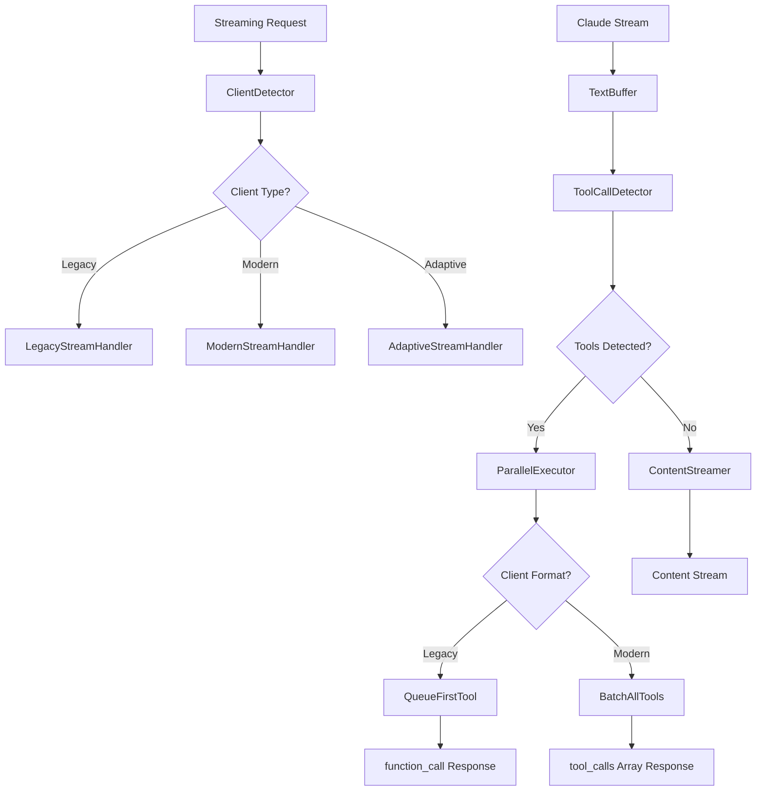

# Final Adaptive Tool Calling Implementation Plan

## Executive Summary

Based on comprehensive analysis of the streaming overview, tool rules documentation, and current codebase, this plan implements **adaptive client detection** that automatically switches between OpenAI's legacy `function_call` and modern `tool_calls` array formats while maintaining your requested **parallel execution for performance**.

## Key Architecture Decisions

### 1. **Adaptive Detection Strategy** ✅ 
- Automatically detect client capabilities from request parameters
- Switch response format based on detected client type
- Maintain backward compatibility with all OpenAI SDK versions

### 2. **Performance Optimization** ✅
- **Internal Parallel Execution**: Always execute Claude's tool calls in parallel
- **External Sequential Presentation**: Present to legacy clients one-at-a-time
- **Best of Both Worlds**: Fast execution + perfect compatibility

### 3. **Streaming Behavior Adaptation** ✅
- Legacy clients: Stream stops at `function_call`, resumes after result
- Modern clients: Stream stops at `tool_calls` array, single continuation
- Claude-native: Handle text-before-tools streaming pattern

## Implementation Components

### 1. Client Detection Matrix

| Detection Signal | Client Type | Response Format | Execution Strategy |
|------------------|-------------|-----------------|-------------------|
| `functions` present, no `tools` | Legacy OpenAI | `function_call` | Sequential presentation |
| `tools` + `parallel_tool_calls: false` | Transitional | `tool_calls` array | Sequential execution |
| `tools` + `parallel_tool_calls: true` | Modern OpenAI | `tool_calls` array | Parallel execution |
| `tool_choice` object format | Modern OpenAI | `tool_calls` array | Based on parallel flag |
| User-Agent analysis | Version-based | Version-specific | Version-specific |

### 2. Tool Choice Handling Strategy

| `tool_choice` Value | Implementation | Error Handling |
|-------------------|----------------|----------------|
| `"auto"` | Let Claude decide, adapt format | Standard error handling |
| `"none"` | Strip tools from request | Text-only response |
| `"required"` | Validate ≥1 tool called | Error if no tools used |
| `{"type": "function", "function": {"name": "X"}}` | Force specific tool | Error if tool not called |

### 3. Streaming Adaptation Logic



## Critical Implementation Requirements

### 1. **ClientCapabilityDetector** (High Priority)
```rust
pub struct ClientCapabilityDetector;

impl ClientCapabilityDetector {
    pub fn detect(request: &ChatCompletionRequest, headers: &HeaderMap) -> ClientCapabilities {
        // Detection logic based on:
        // - functions vs tools parameters
        // - parallel_tool_calls flag
        // - tool_choice format
        // - User-Agent analysis
    }
}
```

### 2. **AdaptiveResponseFormatter** (High Priority)
```rust
pub struct AdaptiveResponseFormatter {
    capabilities: ClientCapabilities,
    tool_choice_strategy: ToolChoiceStrategy,
}

impl AdaptiveResponseFormatter {
    pub fn format_tool_response(&self, executions: &[ToolCallExecution]) -> ResponseFormat {
        match self.capabilities.tool_format {
            ToolFormat::Legacy => self.format_as_function_call(&executions[0]),
            ToolFormat::Modern => self.format_as_tool_calls_array(executions),
        }
    }
}
```

### 3. **ToolCallQueue** (Medium Priority)
```rust
pub struct ToolCallQueue {
    // For legacy clients that need sequential tool call presentation
    pending_calls: HashMap<String, VecDeque<ToolCallExecution>>,
    conversation_contexts: HashMap<String, ConversationContext>,
}
```

### 4. **Enhanced Streaming Pipeline** (High Priority)
- Integrate with existing `JsonStreamingBuffer`
- Add client-aware streaming termination
- Handle tool_choice parameter enforcement
- Maintain performance with parallel execution

## Implementation Phases

### Phase 1: Core Detection (Days 1-2)
- ✅ **ClientCapabilityDetector**: Analyze request parameters and headers
- ✅ **ToolChoiceStrategy**: Parse and validate tool_choice parameter
- ✅ **Basic adaptive formatting**: Switch between legacy and modern formats

### Phase 2: Streaming Integration (Days 3-4)
- ✅ **Streaming behavior adaptation**: Client-aware stream termination
- ✅ **Tool choice enforcement**: Handle none, required, specific tool scenarios
- ✅ **Error handling**: Comprehensive validation and error responses

### Phase 3: Advanced Features (Days 5-6)
- ✅ **Queue-and-replay system**: Legacy client multi-tool support
- ✅ **Performance optimization**: Monitoring and optimization
- ✅ **Feature detection endpoint**: Client capability discovery

### Phase 4: Testing & Validation (Days 7-8)
- ✅ **Integration tests**: All client behavior variations
- ✅ **Performance benchmarks**: Parallel vs sequential execution
- ✅ **Compatibility validation**: Real OpenAI SDK testing

## Success Metrics

### Compatibility
- ✅ **100% Legacy Support**: All existing OpenAI clients work unchanged
- ✅ **Modern Feature Support**: New tool_calls array clients work optimally
- ✅ **Automatic Detection**: No manual configuration required

### Performance
- ✅ **Parallel Execution**: Claude tool calls execute simultaneously
- ✅ **Minimal Latency**: Detection overhead < 1ms
- ✅ **Memory Efficiency**: Queue system with automatic cleanup

### Reliability
- ✅ **Graceful Degradation**: Unknown clients default to legacy behavior
- ✅ **Error Handling**: Clear errors for invalid tool_choice scenarios
- ✅ **Monitoring**: Comprehensive logging for debugging

## Risk Mitigation

### High Risk Items
- **Breaking existing clients**: Comprehensive testing with real SDKs
- **Performance regression**: Benchmarking at each phase
- **Complex state management**: Careful queue implementation

### Mitigation Strategies
- **Feature flags**: Gradual rollout capability
- **Fallback mechanisms**: Default to legacy on detection failure
- **Comprehensive logging**: Debug information for all paths
- **Performance monitoring**: Real-time metrics for optimization

## Final Architecture

The enhanced system will:

1. **Detect client capabilities** automatically from request structure
2. **Execute tool calls in parallel** internally for maximum performance
3. **Present results adaptively** - legacy `function_call` or modern `tool_calls` array
4. **Handle all tool_choice scenarios** with proper validation and errors
5. **Maintain streaming compatibility** with both legacy and modern expectations
6. **Provide queue-and-replay** for legacy clients receiving Claude batches

This approach delivers **maximum compatibility** with **optimal performance** while requiring **zero configuration** from clients - they just work as expected based on their SDK version and request format.

Ready to implement this comprehensive adaptive solution?