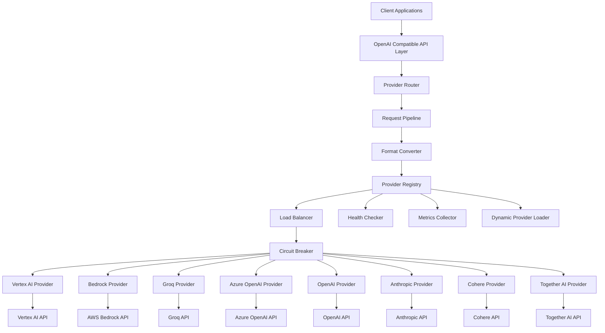

# Multi-Provider OpenAI Compatible Architecture

## Overview

This document outlines the architectural design for implementing a multi-provider OpenAI compatible pipeline that supports Bedrock, Groq, Azure OpenAI, OpenAI, Anthropic, Cohere, and Together AI providers.

## Architecture Diagram



## Core Components

### 1. Provider Trait System
- **AIProvider trait**: Core interface for all providers
- **StreamingProvider trait**: Streaming-specific capabilities
- **ProviderCapabilities**: Feature detection and mapping
- **ProviderMetadata**: Provider information and configuration

### 2. Request Pipeline
- **Unified OpenAI Request Processing**: Single entry point for all requests
- **Format Conversion Layer**: Converts OpenAI format to provider-specific formats
- **Parameter Mapping**: Maps OpenAI parameters to provider equivalents
- **Validation Layer**: Request validation and sanitization

### 3. Provider Registry
- **Dynamic Registration**: Runtime provider registration and discovery
- **Capability Mapping**: Track what features each provider supports
- **Health Monitoring**: Continuous provider health checking
- **Fallback Chains**: Automatic failover between providers

### 4. Load Balancing & Resilience
- **Round Robin/Weighted**: Multiple load balancing strategies
- **Circuit Breaker**: Automatic failure detection and recovery
- **Rate Limiting**: Per-provider rate limiting and throttling
- **Retry Logic**: Intelligent retry with exponential backoff

## Provider Implementation Strategy

### Phase 1: Core Infrastructure
1. Design and implement trait system
2. Create unified pipeline
3. Implement provider registry
4. Refactor existing Vertex AI implementation

### Phase 2: Primary Providers
1. Bedrock (AWS)
2. Groq
3. Azure OpenAI
4. OpenAI

### Phase 3: Additional Providers
1. Anthropic Claude API
2. Cohere
3. Together AI

### Phase 4: Advanced Features
1. Dynamic loading infrastructure
2. Advanced metrics and observability
3. Provider-specific optimizations
4. Comprehensive testing suite

## Configuration Structure

```rust
pub struct MultiProviderConfig {
    pub providers: HashMap<String, ProviderConfig>,
    pub routing: RoutingConfig,
    pub load_balancing: LoadBalancingConfig,
    pub circuit_breaker: CircuitBreakerConfig,
    pub health_check: HealthCheckConfig,
    pub metrics: MetricsConfig,
}

pub enum ProviderConfig {
    Vertex(VertexConfig),
    Bedrock(BedrockConfig),
    Groq(GroqConfig),
    AzureOpenAI(AzureOpenAIConfig),
    OpenAI(OpenAIConfig),
    Anthropic(AnthropicConfig),
    Cohere(CohereConfig),
    TogetherAI(TogetherAIConfig),
}
```

## Key Design Principles

1. **OpenAI Compatibility**: Maintain 100% OpenAI API compatibility
2. **Provider Abstraction**: Clean separation between API layer and providers
3. **Resilience**: Built-in failure handling and recovery
4. **Extensibility**: Easy to add new providers
5. **Performance**: Minimal overhead in request processing
6. **Observability**: Comprehensive metrics and logging
7. **Configuration**: Flexible, environment-specific configuration

## Benefits

- **Vendor Independence**: No lock-in to any single provider
- **High Availability**: Automatic failover between providers
- **Cost Optimization**: Route requests to most cost-effective providers
- **Performance**: Load balancing and intelligent routing
- **Future-Proof**: Easy to add new providers as they emerge