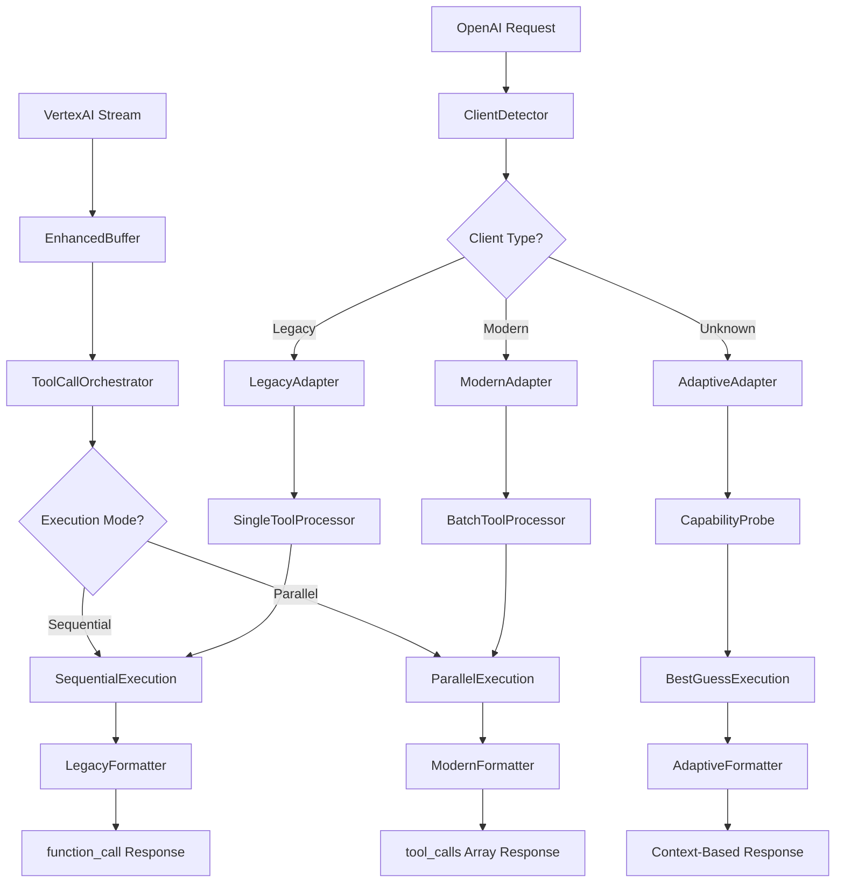

# OpenAI Compatibility Enhancement Plan

## Problem Analysis

Based on the documentation review and research, our current implementation needs significant enhancements to properly handle OpenAI's legacy vs new tool calling behaviors. The key issues are:

### Critical Gaps Identified

1. **Client Behavior Detection**: No mechanism to detect if client expects legacy `function_call` or new `tool_calls` array
2. **Tool Choice Parameter**: Missing support for `tool_choice` (`auto`, `none`, `required`, specific tool)
3. **Parallel Tool Calls Control**: No handling of `parallel_tool_calls` parameter
4. **SDK Version Detection**: No way to determine client capabilities
5. **Streaming Adaptation**: Fixed streaming behavior regardless of client expectations

## OpenAI Behavior Matrix (2024)

| Client Type | Tool Format | Multiple Tools | Streaming Behavior | Detection Method |
|-------------|-------------|----------------|-------------------|------------------|
| **Legacy OpenAI SDK** | `function_call` (single) | ❌ One at a time | Stops at call, resumes after result | No `tool_calls` in request, older User-Agent |
| **New OpenAI SDK** | `tool_calls` array | ✅ Batch supported | Stops at array, single follow-up | `tool_calls` present, `parallel_tool_calls` param |
| **OpenAI-Compatible** | Either format | Depends on SDK | Mirrors OpenAI behavior | User-Agent analysis, API version |

## Client Detection Strategy

### 1. Request Parameter Analysis
```rust
pub struct ClientCapabilities {
    pub supports_tool_calls_array: bool,
    pub supports_parallel_execution: bool,
    pub preferred_tool_format: ToolFormat,
    pub sdk_version: Option<String>,
    pub streaming_expectations: StreamingBehavior,
}

pub enum ToolFormat {
    Legacy,        // function_call
    Modern,        // tool_calls array
    Adaptive,      // Auto-detect based on response
}
```

### 2. Detection Heuristics
- **`parallel_tool_calls` parameter present** → New SDK
- **User-Agent contains OpenAI version ≥ 1.0** → New SDK
- **Request includes `tool_choice` object** → New SDK
- **Only `functions` parameter (no `tools`)** → Legacy SDK
- **Default**: Legacy for maximum compatibility

### 3. Tool Choice Parameter Support

| Value | Behavior | Implementation |
|-------|----------|----------------|
| `"auto"` | Model decides | Default behavior, let Claude choose |
| `"none"` | No tools | Strip tools from request, text-only response |
| `"required"` | Must use tool | Force tool usage, error if no tools available |
| `{"type": "function", "function": {"name": "X"}}` | Specific tool | Force specific tool usage |

## Enhanced Architecture



## Implementation Components

### 1. Client Detection Service
```rust
pub struct ClientDetector {
    user_agent_patterns: HashMap<String, ClientCapabilities>,
    parameter_rules: Vec<DetectionRule>,
}

impl ClientDetector {
    pub fn detect_capabilities(&self, request: &ChatCompletionRequest, headers: &HeaderMap) -> ClientCapabilities {
        // Analyze request parameters, headers, and structure
        // Return detected capabilities
    }
}
```

### 2. Adaptive Response Formatter
```rust
pub struct AdaptiveResponseFormatter {
    capabilities: ClientCapabilities,
}

impl AdaptiveResponseFormatter {
    pub fn format_tool_calls(&self, executions: &[ToolCallExecution]) -> ResponseFormat {
        match self.capabilities.preferred_tool_format {
            ToolFormat::Legacy => self.format_as_function_call(&executions[0]),
            ToolFormat::Modern => self.format_as_tool_calls_array(executions),
            ToolFormat::Adaptive => self.choose_best_format(executions),
        }
    }
}
```

### 3. Queue-and-Replay System
```rust
pub struct ToolCallQueue {
    pending_calls: HashMap<String, Vec<ToolCallExecution>>,
    conversation_state: HashMap<String, ConversationContext>,
}

impl ToolCallQueue {
    pub fn queue_remaining_calls(&mut self, conversation_id: &str, calls: Vec<ToolCallExecution>) {
        // Store remaining calls for legacy clients
    }
    
    pub fn get_next_call(&mut self, conversation_id: &str) -> Option<ToolCallExecution> {
        // Return next queued call for legacy sequential processing
    }
}
```

### 4. Enhanced Tool Choice Handling
```rust
pub enum ToolChoiceStrategy {
    Auto,                           // Let model decide
    None,                          // No tools allowed
    Required,                      // Must use at least one tool
    Specific { name: String },     // Must use specific tool
}

impl ToolChoiceStrategy {
    pub fn from_request(request: &ChatCompletionRequest) -> Self {
        // Parse tool_choice parameter and return strategy
    }
    
    pub fn apply_to_vertex_request(&self, vertex_request: &mut VertexPredictRequest) {
        // Modify Vertex request based on tool choice strategy
    }
}
```

## Key Enhancements Needed

### 1. Request Analysis Enhancement
- Parse `tool_choice` parameter (string or object)
- Detect `parallel_tool_calls` boolean
- Analyze User-Agent for SDK version
- Check for legacy `functions` vs new `tools` parameter

### 2. Response Format Adaptation
- **Legacy Mode**: Single `function_call`, queue remaining calls
- **Modern Mode**: `tool_calls` array with all calls
- **Streaming**: Adapt stream termination based on client expectations

### 3. Tool Execution Control
- **`tool_choice: "none"`**: Strip tools, text-only response
- **`tool_choice: "required"`**: Error if no tools called
- **`tool_choice: {"type": "function", "function": {"name": "X"}}`**: Force specific tool
- **`parallel_tool_calls: false`**: Execute sequentially even internally

### 4. Streaming Behavior Adaptation
- **Legacy Clients**: Stream stops at first tool call, resume after result
- **Modern Clients**: Stream stops at tool_calls array, single continuation
- **Adaptive**: Detect based on request structure and headers

## Success Criteria

1. **100% OpenAI Compatibility**: Both legacy and modern clients work seamlessly
2. **Performance Optimized**: Parallel execution where possible, sequential where required
3. **Automatic Detection**: No manual configuration needed for client type
4. **Graceful Degradation**: Unknown clients default to legacy behavior
5. **Feature Complete**: All OpenAI tool calling parameters supported

## Implementation Priority

### Phase 1: Core Detection (High Priority)
- Client capability detection
- Tool choice parameter parsing
- Basic adaptive formatting

### Phase 2: Advanced Features (Medium Priority)
- Queue-and-replay system
- Streaming behavior adaptation
- Performance optimization

### Phase 3: Polish (Low Priority)
- Feature detection endpoint
- Comprehensive monitoring
- Advanced error scenarios

## Risk Mitigation

### High Risk
- **Breaking existing clients**: Ensure backward compatibility
- **Performance regression**: Monitor execution times
- **Complex state management**: Careful queue implementation

### Mitigation Strategies
- **Feature flags** for gradual rollout
- **Comprehensive testing** with different client types
- **Fallback mechanisms** for detection failures
- **Performance benchmarks** for each execution path

## Testing Strategy

### Client Simulation Tests
- Legacy OpenAI SDK behavior
- Modern OpenAI SDK with tool_calls array
- Various tool_choice parameter combinations
- Different parallel_tool_calls settings

### Performance Tests
- Parallel vs sequential execution timing
- Queue management overhead
- Streaming latency comparison
- Memory usage under load

### Compatibility Tests
- Real OpenAI SDK integration
- Third-party OpenAI-compatible libraries
- Edge cases and error scenarios

This plan ensures we maintain the performance benefits of parallel execution while providing perfect OpenAI compatibility for all client types.