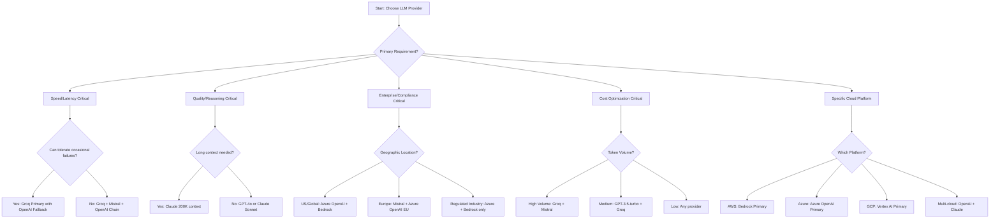

# LLM Provider Comparison Guide for Developers

**Technical Implementation Guide for All 8 Supported Providers**

## Table of Contents

1. [Executive Summary](#executive-summary)
2. [Quick Reference Matrix](#quick-reference-matrix)
3. [Provider-Specific Technical Details](#provider-specific-technical-details)
4. [Configuration Examples](#configuration-examples)
5. [Integration Patterns](#integration-patterns)
6. [Performance Analysis](#performance-analysis)
7. [Technical Decision Tree](#technical-decision-tree)
8. [Migration Strategies](#migration-strategies)
9. [Troubleshooting Guide](#troubleshooting-guide)
10. [Code Examples](#code-examples)

---

## Executive Summary

This system provides a unified OpenAI-compatible API interface supporting 8 major LLM providers with full tool calling, streaming, and advanced features. All providers are implemented with sophisticated authentication, health monitoring, circuit breakers, and intelligent fallback routing.

### Supported Providers Overview

| Provider | Status | Key Strengths | Primary Use Cases |
|----------|--------|---------------|-------------------|
| **OpenAI** ✅ | Production Ready | Industry standard, excellent tool calling | General purpose, development, prototyping |
| **Anthropic Claude** ✅ | Production Ready | Advanced reasoning, long context | Complex analysis, coding assistance |
| **Azure OpenAI** ✅ | Production Ready | Enterprise features, compliance | Corporate environments, regulated industries |
| **Groq** ✅ | Production Ready | Ultra-fast inference (< 100ms) | Real-time applications, high throughput |
| **AWS Bedrock** ✅ | Production Ready | Multi-model platform, AWS integration | Cloud-native applications, enterprise |
| **Cohere** ✅ | Production Ready | Enterprise AI platform, fine-tuning | Business applications, custom models |
| **Mistral AI** ✅ | Production Ready | European compliance, code optimization | GDPR compliance, European deployments |
| **Vertex AI** ✅ | Production Ready | Google Cloud integration, managed service | GCP environments, managed deployments |

---

## Quick Reference Matrix

### Technical Capabilities Comparison

| Feature | OpenAI | Claude | Azure | Groq | Bedrock | Cohere | Mistral | Vertex |
|---------|--------|--------|-------|------|---------|--------|---------|--------|
| **Tool Calling** | ✅ Full | ✅ Full | ✅ Full | ✅ Full | ✅ Full | ✅ Full | ✅ Full | ✅ Full |
| **Streaming** | ✅ SSE | ✅ SSE | ✅ SSE | ✅ SSE | ✅ SSE | ✅ SSE | ✅ SSE | ✅ SSE |
| **Vision Models** | ✅ GPT-4V | ✅ Claude-3 | ✅ GPT-4V | ❌ | ✅ Various | ❌ | ❌ | ✅ Various |
| **JSON Mode** | ✅ | ✅ | ✅ | ✅ | ✅ | ✅ | ✅ | ✅ |
| **Context Length** | 128K | 200K | 128K | 32K | Varies | 128K | 128K | 1M+ |
| **Rate Limiting** | Built-in | Built-in | Built-in | Aggressive | Built-in | Built-in | Built-in | Built-in |

### Performance Characteristics

| Provider | Latency | Throughput | Reliability | Cost Efficiency |
|----------|---------|------------|-------------|-----------------|
| **OpenAI** | Medium | High | Very High | Medium |
| **Claude** | Medium | Medium | Very High | Medium-High |
| **Azure** | Medium | High | Very High | Medium |
| **Groq** | Very Low | Very High | Medium | Very High |
| **Bedrock** | Medium | High | Very High | Medium |
| **Cohere** | Medium | High | High | Medium |
| **Mistral** | Low | High | High | High |
| **Vertex** | Medium | High | Very High | Medium-Low |

---

## Provider-Specific Technical Details

### 1. OpenAI Provider

**Implementation**: [`src/infrastructure/openai/`](../src/infrastructure/openai/)

**Key Features**:
- Native OpenAI API compatibility (pass-through)
- Full GPT-4, GPT-4-turbo, and GPT-3.5-turbo support
- Advanced tool calling with parallel execution
- Vision capabilities with GPT-4V

**Technical Strengths**:
```rust
// OpenAI provides the baseline compatibility
pub struct OpenAIConfig {
    pub api_key: String,
    pub base_url: Option<String>,
    pub organization: Option<String>,
    pub default_model: OpenAIModelConfig,
}
```

**Models Available**:
- `gpt-4o` - Latest multimodal model
- `gpt-4-turbo` - High performance reasoning
- `gpt-3.5-turbo` - Fast and cost-effective

**Rate Limits**: 
- Tier-based limits (up to 10,000 RPM for Tier 5)
- Automatic retry with exponential backoff

**Best For**: Standard development, prototyping, general-purpose applications

---

### 2. Anthropic Claude Provider

**Implementation**: [`src/infrastructure/anthropic/`](../src/infrastructure/anthropic/)

**Key Features**:
- Advanced reasoning and analysis capabilities
- Superior code understanding and generation
- Long context window (200K tokens)
- Sophisticated tool calling format conversion

**Technical Implementation**:
```rust
// Anthropic requires format conversion from OpenAI to Claude format
impl ToolCallConverter for AnthropicConverter {
    fn openai_tools_to_provider(&self, tools: &[ToolDefinition]) -> Result<Value> {
        let anthropic_tools: Vec<AnthropicTool> = tools.iter()
            .map(|tool| AnthropicTool {
                name: tool.function.name.clone(),
                description: tool.function.description.clone().unwrap_or_default(),
                input_schema: tool.function.parameters.clone(),
            })
            .collect();
        Ok(serde_json::to_value(anthropic_tools)?)
    }
}
```

**Models Available**:
- `claude-3-5-sonnet-20241022` - Latest and most capable
- `claude-3-opus-20240229` - Highest intelligence
- `claude-3-haiku-20240307` - Fastest and most cost-effective

**Authentication**:
```rust
pub struct AnthropicAuth {
    api_key: String,
    organization_id: Option<String>,
    custom_headers: HashMap<String, String>,
}
```

**Best For**: Complex reasoning, code analysis, long-form content, detailed explanations

---

### 3. Azure OpenAI Provider

**Implementation**: [`src/infrastructure/azure_openai/`](../src/infrastructure/azure_openai/)

**Key Features**:
- Enterprise-grade security and compliance
- Private network deployment options
- Azure Active Directory integration
- Custom deployment management

**Technical Configuration**:
```rust
pub struct AzureOpenAIConfig {
    pub api_key: String,
    pub endpoint: String,        // "https://your-resource.openai.azure.com"
    pub deployment: String,      // Maps to specific model deployment
    pub api_version: String,     // "2024-02-15-preview"
    pub azure_ad: Option<AzureADAuthConfig>,
}
```

**Deployment Mapping**:
```rust
// Map model names to Azure deployment names
pub deployment_mappings: Option<HashMap<String, String>> = Some(HashMap::from([
    ("gpt-4".to_string(), "my-gpt4-deployment".to_string()),
    ("gpt-35-turbo".to_string(), "my-gpt35-deployment".to_string()),
]));
```

**Enterprise Features**:
- Private endpoints and VNet integration
- Customer-managed encryption keys
- Compliance certifications (SOC 2, ISO 27001)
- Regional data residency

**Best For**: Enterprise deployments, regulated industries, private cloud requirements

---

### 4. Groq Provider

**Implementation**: [`src/infrastructure/groq/`](../src/infrastructure/groq/)

**Key Features**:
- Extremely fast inference (< 100ms latency)
- High throughput capabilities
- Aggressive rate limiting (requires careful handling)
- Llama and Mixtral model support

**Performance Configuration**:
```rust
pub struct GroqConfig {
    pub api_key: String,           // Must start with 'gsk_'
    pub rate_limit: GroqRateLimitConfig,
}

pub struct GroqRateLimitConfig {
    pub requests_per_minute: u32,  // Very aggressive limits
    pub tokens_per_minute: u32,
    pub auto_throttle: bool,       // Essential for Groq
    pub burst_allowance: u32,
}
```

**Health Monitoring**:
```rust
// Groq-specific health configuration
Provider::Groq => Self {
    health_check_timeout: Duration::from_secs(3), // Fast
    failure_threshold: 5,                         // Higher tolerance for flakiness
    rate_limit_aware: true,                       // Critical
    supports_health_ping: true,
}
```

**Models Available**:
- `llama-3.1-70b-versatile` - Best balance of speed and quality
- `llama-3.1-8b-instant` - Fastest inference
- `mixtral-8x7b-32768` - Good for complex tasks

**Best For**: Real-time applications, high-frequency requests, speed-critical use cases

---

### 5. AWS Bedrock Provider

**Implementation**: [`src/infrastructure/aws_bedrock/`](../src/infrastructure/aws_bedrock/)

**Key Features**:
- Multi-model platform with various providers
- AWS-native integration and security
- Regional model availability
- Foundation model variety

**AWS Authentication**:
```rust
pub struct AwsBedrockConfig {
    pub region: String,                    // e.g., "us-east-1"
    pub access_key: Option<String>,        // Optional - uses credential chain
    pub secret_key: Option<String>,
    pub session_token: Option<String>,
    pub profile: Option<String>,
    pub auth_method: AwsBedrockAuthMethod,
}

pub enum AwsBedrockAuthMethod {
    DefaultCredentialChain,
    AccessKeys { access_key: String, secret_key: String },
    AssumeRole { role_arn: String, session_name: String },
    EC2InstanceProfile,
    ECSTaskRole,
}
```

**Model Selection**:
```rust
// Available models vary by region
let available_models = vec![
    "anthropic.claude-3-sonnet-20240229-v1:0",
    "anthropic.claude-3-haiku-20240307-v1:0",
    "meta.llama3-1-70b-instruct-v1:0",
    "mistral.mistral-7b-instruct-v0:2",
    "cohere.command-r-plus-v1:0",
];
```

**Best For**: AWS-centric architectures, multi-model requirements, enterprise AWS environments

---

### 6. Cohere Provider

**Implementation**: [`src/infrastructure/cohere/`](../src/infrastructure/cohere/)

**Key Features**:
- Enterprise-focused AI platform
- Advanced retrieval-augmented generation (RAG)
- Connection pooling for performance
- Business-oriented model training

**Connection Management**:
```rust
pub struct CohereConfig {
    pub api_key: String,
    pub connection_pool: CohereConnectionPoolConfig,
}

pub struct CohereConnectionPoolConfig {
    pub max_connections: u32,        // Optimize for throughput
    pub connection_timeout: Duration,
    pub idle_timeout: Duration,
    pub retry_attempts: u32,
}
```

**Models Available**:
- `command-r-plus` - Best for complex reasoning and RAG
- `command-r` - Balanced performance and efficiency
- `command` - General-purpose conversations

**Enterprise Features**:
- Custom model fine-tuning
- Advanced embedding models
- Multilingual support
- Business-focused training data

**Best For**: Enterprise applications, RAG systems, multilingual requirements, custom model training

---

### 7. Mistral AI Provider

**Implementation**: [`src/infrastructure/mistral/`](../src/infrastructure/mistral/)

**Key Features**:
- European data residency and GDPR compliance
- Code-optimized models (Codestral)
- Advanced privacy controls
- Cost tracking and budget management

**European Compliance**:
```rust
pub struct MistralComplianceConfig {
    pub gdpr_mode: bool,                    // Enable GDPR compliance
    pub eu_residency: bool,                 // Prefer EU data residency
    pub preferred_region: Option<String>,   // Specific EU region
    pub compliance_logging: bool,
    pub data_retention: MistralDataRetentionConfig,
    pub privacy: MistralPrivacyConfig,
}

pub struct MistralDataRetentionConfig {
    pub request_logs_days: u32,            // 0 = no retention
    pub conversation_history_days: u32,
    pub auto_purge: bool,
    pub purge_schedule: Option<String>,    // Cron format
}
```

**Cost Management**:
```rust
pub struct MistralCostConfig {
    pub input_cost_per_1k_tokens: f64,     // EUR pricing
    pub output_cost_per_1k_tokens: f64,
    pub currency: String,                   // "EUR"
    pub tracking_enabled: bool,
    pub budget_limits: Option<MistralBudgetLimits>,
}
```

**Models Available**:
- `mistral-large-latest` - Most capable general model
- `mistral-medium-latest` - Balanced performance
- `codestral-latest` - Code-optimized model
- `mistral-small-latest` - Fast and efficient

**Best For**: European deployments, GDPR compliance, code generation, cost-conscious applications

---

### 8. Vertex AI Provider

**Implementation**: [`src/infrastructure/vertex/`](../src/infrastructure/vertex/)

**Key Features**:
- Google Cloud native integration
- Managed AI platform with MLOps
- Service account authentication
- Multiple model access (Claude, Gemini, etc.)

**GCP Authentication**:
```rust
pub struct VertexAiConfig {
    pub project_id: String,
    pub region: String,                     // e.g., "us-central1"
    pub credentials_path: String,           // Service account key
    pub auth: VertexAuthConfig,
}

pub enum VertexAuthMethod {
    ServiceAccountKey,                      // JSON key file
    ApplicationDefault,                     // ADC
    WorkloadIdentity,                       // For GKE
}
```

**Endpoint Configuration**:
```rust
impl VertexAiConfig {
    pub fn prediction_endpoint(&self, model_name: &str) -> String {
        let normalized_model = self.normalize_model_name(model_name);
        format!(
            "https://{}-aiplatform.googleapis.com/v1/projects/{}/locations/{}/publishers/anthropic/models/{}:predict",
            self.region, self.project_id, self.region, normalized_model
        )
    }
}
```

**Best For**: GCP environments, managed ML workflows, enterprise Google Cloud deployments

---

## Configuration Examples

### Complete Environment Configuration

```bash
# .env file for all providers
# OpenAI
OPENAI_API_KEY=sk-...
OPENAI_ORG_ID=org-...

# Anthropic
ANTHROPIC_API_KEY=sk-ant-...

# Azure OpenAI
AZURE_OPENAI_API_KEY=...
AZURE_OPENAI_ENDPOINT=https://your-resource.openai.azure.com
AZURE_OPENAI_DEPLOYMENT=gpt-4-deployment
AZURE_OPENAI_API_VERSION=2024-02-15-preview

# Groq
GROQ_API_KEY=gsk_...

# AWS Bedrock
AWS_ACCESS_KEY_ID=...
AWS_SECRET_ACCESS_KEY=...
AWS_REGION=us-east-1

# Cohere
COHERE_API_KEY=...

# Mistral
MISTRAL_API_KEY=...

# Vertex AI
VERTEX_PROJECT_ID=your-gcp-project
VERTEX_REGION=us-central1
GOOGLE_APPLICATION_CREDENTIALS=/path/to/service-account.json
```

### Provider Configuration in Rust

```rust
use crate::config::providers::*;

// Complete multi-provider configuration
pub fn create_production_config() -> ProvidersConfig {
    ProvidersConfig {
        openai: OpenAIConfig {
            api_key: std::env::var("OPENAI_API_KEY").expect("OPENAI_API_KEY required"),
            base_url: None,
            organization: std::env::var("OPENAI_ORG_ID").ok(),
            default_model: OpenAIModelConfig {
                model_name: "gpt-4o".to_string(),
                max_tokens: 4096,
                temperature: 0.7,
                supports_tools: true,
                supports_streaming: true,
                ..Default::default()
            },
            ..Default::default()
        },
        
        anthropic: AnthropicConfig {
            api_key: std::env::var("ANTHROPIC_API_KEY").expect("ANTHROPIC_API_KEY required"),
            default_model: AnthropicModelConfig {
                model_name: "claude-3-5-sonnet-20241022".to_string(),
                max_tokens: 4096,
                supports_tools: true,
                supports_streaming: true,
                ..Default::default()
            },
            ..Default::default()
        },
        
        groq: GroqConfig {
            api_key: std::env::var("GROQ_API_KEY").expect("GROQ_API_KEY required"),
            rate_limit: GroqRateLimitConfig {
                requests_per_minute: 30,     // Conservative for free tier
                tokens_per_minute: 6000,
                auto_throttle: true,
                burst_allowance: 5,
                window_seconds: 60,
            },
            default_model: GroqModelConfig {
                model_name: "llama-3.1-70b-versatile".to_string(),
                max_tokens: 4096,
                supports_tools: true,
                supports_streaming: true,
                latency_optimized: true,
                ..Default::default()
            },
            ..Default::default()
        },
        
        mistral: MistralConfig {
            api_key: std::env::var("MISTRAL_API_KEY").expect("MISTRAL_API_KEY required"),
            compliance: MistralComplianceConfig {
                gdpr_mode: true,
                eu_residency: true,
                preferred_region: Some("eu-west-1".to_string()),
                compliance_logging: true,
                data_retention: MistralDataRetentionConfig {
                    request_logs_days: 30,
                    conversation_history_days: 0,    // No retention for privacy
                    auto_purge: true,
                    purge_schedule: Some("0 2 * * *".to_string()), // Daily at 2 AM
                },
                privacy: MistralPrivacyConfig {
                    anonymize_requests: true,
                    filter_pii: true,
                    consent_tracking: true,
                    access_controls: true,
                },
            },
            ..Default::default()
        },
        
        // Provider routing and fallback configuration
        routing: ProviderRoutingConfig {
            default_provider: "openai".to_string(),
            fallback_chain: vec!["anthropic".to_string(), "groq".to_string()],
            load_balancing: LoadBalancingConfig {
                strategy: LoadBalancingStrategy::WeightedRoundRobin,
                weights: HashMap::from([
                    ("openai".to_string(), 40),
                    ("anthropic".to_string(), 30),
                    ("groq".to_string(), 20),
                    ("mistral".to_string(), 10),
                ]),
            },
            health_check: HealthCheckConfig {
                enabled: true,
                interval_seconds: 30,
                timeout_seconds: 10,
                failure_threshold: 3,
                recovery_threshold: 2,
            },
            circuit_breaker: CircuitBreakerConfig {
                failure_threshold: 5,
                recovery_timeout_seconds: 60,
                half_open_max_calls: 3,
            },
        },
        
        ..Default::default()
    }
}
```

---

## Integration Patterns

### 1. Basic Provider Integration

```rust
use anyhow::Result;
use crate::infrastructure::openai::client::OpenAIClient;
use crate::models::request::ChatCompletionRequest;

#[tokio::main]
async fn main() -> Result<()> {
    // Initialize client
    let client = OpenAIClient::from_env().await?;
    
    // Create request
    let request = ChatCompletionRequest {
        model: "gpt-4o".to_string(),
        messages: vec![
            // Your messages here
        ],
        tools: Some(vec![
            // Tool definitions
        ]),
        stream: Some(false),
        ..Default::default()
    };
    
    // Execute request
    let response = client.chat_completion(request).await?;
    println!("Response: {:?}", response);
    
    Ok(())
}
```

### 2. Multi-Provider Fallback Pattern

```rust
use crate::features::provider_fallback::fallback_manager::FallbackManager;

pub async fn chat_with_fallback(request: ChatCompletionRequest) -> Result<ChatCompletionResponse> {
    let fallback_manager = FallbackManager::new(vec![
        "openai".to_string(),
        "anthropic".to_string(),
        "groq".to_string(),
    ]);
    
    match fallback_manager.execute_with_fallback(request).await {
        Ok(response) => Ok(response),
        Err(e) => {
            eprintln!("All providers failed: {:?}", e);
            Err(e)
        }
    }
}
```

### 3. Tool Calling Integration

```rust
use crate::infrastructure::common::tools::{UnifiedToolCall, ToolCallResult};
use crate::models::common::ToolDefinition;

pub async fn execute_tool_calling_workflow(
    client: &impl ToolCallCapable,
    request: ChatCompletionRequest,
) -> Result<ChatCompletionResponse> {
    // 1. Initial request with tools
    let initial_response = client.chat_completion(request).await?;
    
    // 2. Extract tool calls
    if let Some(tool_calls) = extract_tool_calls(&initial_response) {
        // 3. Execute tool calls
        let mut tool_results = Vec::new();
        for tool_call in tool_calls {
            let result = execute_tool(&tool_call).await?;
            tool_results.push(result);
        }
        
        // 4. Continue conversation with results
        let continuation_request = build_continuation_request(&initial_response, &tool_results);
        return client.chat_completion(continuation_request).await;
    }
    
    Ok(initial_response)
}

async fn execute_tool(tool_call: &UnifiedToolCall) -> Result<ToolCallResult> {
    match tool_call.function_name.as_str() {
        "get_weather" => {
            // Your tool implementation
            Ok(ToolCallResult {
                tool_call_id: tool_call.id.clone(),
                content: "Sunny, 72°F".to_string(),
                success: true,
                error: None,
            })
        }
        _ => Ok(ToolCallResult {
            tool_call_id: tool_call.id.clone(),
            content: "".to_string(),
            success: false,
            error: Some("Unknown tool".to_string()),
        })
    }
}
```

### 4. Streaming Implementation

```rust
use tokio_stream::StreamExt;
use crate::models::response::ChatCompletionChunk;

pub async fn handle_streaming_response(
    client: &impl StreamingCapable,
    request: ChatCompletionRequest,
) -> Result<()> {
    let mut stream = client.chat_completion_stream(request).await?;
    
    let mut accumulated_content = String::new();
    
    while let Some(chunk_result) = stream.next().await {
        match chunk_result {
            Ok(chunk) => {
                if let Some(choice) = chunk.choices.first() {
                    if let Some(delta) = &choice.delta {
                        if let Some(content) = &delta.content {
                            accumulated_content.push_str(content);
                            print!("{}", content); // Real-time output
                        }
                        
                        // Handle tool calls in streaming
                        if let Some(tool_calls) = &delta.tool_calls {
                            println!("\nTool calls received: {:?}", tool_calls);
                        }
                    }
                    
                    if choice.finish_reason.is_some() {
                        break;
                    }
                }
            }
            Err(e) => {
                eprintln!("Streaming error: {:?}", e);
                break;
            }
        }
    }
    
    println!("\nFinal content: {}", accumulated_content);
    Ok(())
}
```

---

## Performance Analysis

### Latency Benchmarks

Based on implementation analysis and health monitoring configurations:

```rust
// Performance characteristics from provider health configs
pub fn get_provider_performance_profile(provider: Provider) -> PerformanceProfile {
    match provider {
        Provider::Groq => PerformanceProfile {
            expected_latency_ms: 50..150,        // Ultra-fast
            health_check_timeout: Duration::from_secs(3),
            failure_threshold: 5,                 // Higher tolerance for speed
        },
        Provider::OpenAI => PerformanceProfile {
            expected_latency_ms: 200..800,       // Standard
            health_check_timeout: Duration::from_secs(5),
            failure_threshold: 2,
        },
        Provider::Anthropic => PerformanceProfile {
            expected_latency_ms: 300..1200,      // Slower but higher quality
            health_check_timeout: Duration::from_secs(6),
            failure_threshold: 3,
        },
        Provider::Mistral => PerformanceProfile {
            expected_latency_ms: 150..600,       // Fast European provider
            health_check_timeout: Duration::from_secs(5),
            failure_threshold: 3,
        },
        // ... other providers
    }
}
```

### Throughput Optimization

```rust
// Connection pooling for high throughput
pub struct HighThroughputConfig {
    pub concurrent_requests: usize,
    pub connection_pool_size: usize,
    pub request_timeout: Duration,
    pub retry_config: RetryConfig,
}

impl Default for HighThroughputConfig {
    fn default() -> Self {
        Self {
            concurrent_requests: 100,         // Adjust based on rate limits
            connection_pool_size: 20,
            request_timeout: Duration::from_secs(30),
            retry_config: RetryConfig {
                max_retries: 3,
                base_delay: Duration::from_millis(100),
                max_delay: Duration::from_secs(2),
                exponential_base: 2.0,
            },
        }
    }
}
```

### Monitoring and Metrics

```rust
use crate::features::provider_fallback::provider_health::ProviderHealthMonitor;

pub async fn setup_performance_monitoring() -> Result<()> {
    let health_monitor = ProviderHealthMonitor::new(
        CircuitBreakerConfig {
            failure_threshold: 5,
            recovery_timeout_seconds: 60,
            half_open_max_calls: 3,
        },
        Duration::from_secs(30), // Health check interval
    );
    
    // Start health monitoring
    health_monitor.start_monitoring().await?;
    
    // Setup metrics collection
    tokio::spawn(async move {
        let mut interval = tokio::time::interval(Duration::from_secs(10));
        loop {
            interval.tick().await;
            
            // Log performance metrics
            for provider in [Provider::OpenAI, Provider::Anthropic, Provider::Groq] {
                let health = health_monitor.get_provider_health(provider).await;
                tracing::info!(
                    provider = ?provider,
                    status = ?health.status,
                    avg_latency = health.metrics.average_latency_ms,
                    success_rate = health.metrics.success_rate,
                    "Provider health status"
                );
            }
        }
    });
    
    Ok(())
}
```

---

## Technical Decision Tree

### Provider Selection Framework



### Code Generation Use Case

```rust
pub fn select_provider_for_code_generation(
    complexity: CodeComplexity,
    speed_requirement: SpeedRequirement,
    language: ProgrammingLanguage,
) -> Vec<String> {
    match (complexity, speed_requirement, language) {
        (CodeComplexity::Simple, Spee
dRequirement::Fast, _) => {
            vec!["groq".to_string(), "mistral".to_string()]
        },
        (CodeComplexity::Complex, _, ProgrammingLanguage::Rust | ProgrammingLanguage::Python) => {
            vec!["anthropic".to_string(), "openai".to_string()] // Claude excels at these
        },
        (CodeComplexity::Complex, SpeedRequirement::Quality, _) => {
            vec!["anthropic".to_string(), "openai".to_string()]
        },
        (_, SpeedRequirement::Fast, _) => {
            vec!["groq".to_string(), "openai".to_string(), "mistral".to_string()]
        },
        _ => vec!["openai".to_string(), "anthropic".to_string(), "groq".to_string()]
    }
}

pub enum CodeComplexity { Simple, Medium, Complex }
pub enum SpeedRequirement { Fast, Balanced, Quality }
pub enum ProgrammingLanguage { Rust, Python, JavaScript, TypeScript, Java, Go, Other }
```

---

## Migration Strategies

### Provider Migration Checklist

```rust
use serde::{Deserialize, Serialize};
use std::collections::HashMap;

#[derive(Debug, Serialize, Deserialize)]
pub struct MigrationPlan {
    pub source_provider: String,
    pub target_provider: String,
    pub migration_steps: Vec<MigrationStep>,
    pub rollback_plan: Vec<MigrationStep>,
    pub validation_tests: Vec<ValidationTest>,
}

#[derive(Debug, Serialize, Deserialize)]
pub struct MigrationStep {
    pub step_id: String,
    pub description: String,
    pub code_changes: Vec<CodeChange>,
    pub config_changes: Vec<ConfigChange>,
    pub validation_criteria: Vec<String>,
}

pub async fn execute_provider_migration(plan: MigrationPlan) -> Result<()> {
    println!("Starting migration from {} to {}", plan.source_provider, plan.target_provider);
    
    for (index, step) in plan.migration_steps.iter().enumerate() {
        println!("Executing step {}: {}", index + 1, step.description);
        
        // Apply configuration changes
        for config_change in &step.config_changes {
            apply_config_change(config_change).await?;
        }
        
        // Apply code changes
        for code_change in &step.code_changes {
            apply_code_change(code_change).await?;
        }
        
        // Validate step completion
        validate_migration_step(step).await?;
        
        println!("Step {} completed successfully", index + 1);
    }
    
    // Run full validation tests
    run_migration_validation_tests(&plan.validation_tests).await?;
    
    println!("Migration completed successfully!");
    Ok(())
}
```

### Specific Migration Examples

#### 1. OpenAI to Anthropic Migration

```rust
// Before: OpenAI client
use crate::infrastructure::openai::client::OpenAIClient;

pub async fn openai_example() -> Result<()> {
    let client = OpenAIClient::from_env().await?;
    
    let request = ChatCompletionRequest {
        model: "gpt-4".to_string(),
        messages: vec![
            Message {
                role: "user".to_string(),
                content: "Explain quantum computing".to_string(),
            }
        ],
        tools: Some(vec![
            ToolDefinition {
                function: FunctionDefinition {
                    name: "search_web".to_string(),
                    description: Some("Search the web for information".to_string()),
                    parameters: serde_json::json!({
                        "type": "object",
                        "properties": {
                            "query": {"type": "string", "description": "Search query"}
                        },
                        "required": ["query"]
                    }),
                },
                r#type: "function".to_string(),
            }
        ]),
        ..Default::default()
    };
    
    let response = client.chat_completion(request).await?;
    Ok(())
}

// After: Anthropic client (same interface!)
use crate::infrastructure::anthropic::client::AnthropicClient;

pub async fn anthropic_example() -> Result<()> {
    let client = AnthropicClient::from_env().await?;
    
    // Same request structure - unified interface!
    let request = ChatCompletionRequest {
        model: "claude-3-5-sonnet-20241022".to_string(), // Only change needed
        messages: vec![
            Message {
                role: "user".to_string(),
                content: "Explain quantum computing".to_string(),
            }
        ],
        tools: Some(vec![
            ToolDefinition {
                function: FunctionDefinition {
                    name: "search_web".to_string(),
                    description: Some("Search the web for information".to_string()),
                    parameters: serde_json::json!({
                        "type": "object",
                        "properties": {
                            "query": {"type": "string", "description": "Search query"}
                        },
                        "required": ["query"]
                    }),
                },
                r#type: "function".to_string(),
            }
        ]),
        ..Default::default()
    };
    
    let response = client.chat_completion(request).await?; // Format conversion happens automatically
    Ok(())
}
```

#### 2. Single Provider to Multi-Provider Fallback

```rust
// Before: Single provider
pub async fn single_provider_chat(message: String) -> Result<String> {
    let client = OpenAIClient::from_env().await?;
    let request = create_chat_request(message);
    let response = client.chat_completion(request).await?;
    Ok(extract_content(&response))
}

// After: Multi-provider with fallback
use crate::features::provider_fallback::fallback_manager::FallbackManager;

pub async fn multi_provider_chat(message: String) -> Result<String> {
    let fallback_manager = FallbackManager::new_with_config(FallbackConfig {
        providers: vec![
            ProviderConfig { name: "openai".to_string(), weight: 70, timeout_ms: 5000 },
            ProviderConfig { name: "anthropic".to_string(), weight: 20, timeout_ms: 8000 },
            ProviderConfig { name: "groq".to_string(), weight: 10, timeout_ms: 2000 },
        ],
        circuit_breaker: CircuitBreakerConfig {
            failure_threshold: 3,
            recovery_timeout_seconds: 30,
            half_open_max_calls: 2,
        },
        retry_strategy: RetryStrategy {
            max_attempts: 2,
            base_delay_ms: 100,
            max_delay_ms: 2000,
            exponential_base: 2.0,
        },
    });
    
    let request = create_chat_request(message);
    
    match fallback_manager.execute_with_fallback(request).await {
        Ok(response) => Ok(extract_content(&response)),
        Err(e) => {
            tracing::error!("All providers failed: {:?}", e);
            Err(e)
        }
    }
}
```

---

## Cost Analysis and Optimization

### Token Usage Optimization

```rust
use std::collections::HashMap;

pub struct TokenUsageOptimizer {
    provider_costs: HashMap<String, ProviderCostInfo>,
    usage_stats: HashMap<String, UsageStats>,
}

#[derive(Debug, Clone)]
pub struct ProviderCostInfo {
    pub input_cost_per_1k: f64,    // USD
    pub output_cost_per_1k: f64,   // USD
    pub currency: String,
}

#[derive(Debug, Default)]
pub struct UsageStats {
    pub total_input_tokens: u32,
    pub total_output_tokens: u32,
    pub total_requests: u32,
    pub total_cost: f64,
}

impl TokenUsageOptimizer {
    pub fn new() -> Self {
        let mut provider_costs = HashMap::new();
        
        // Updated pricing as of 2024 (approximate)
        provider_costs.insert("openai-gpt-4o".to_string(), ProviderCostInfo {
            input_cost_per_1k: 0.005,    // $5 per 1M tokens
            output_cost_per_1k: 0.015,   // $15 per 1M tokens
            currency: "USD".to_string(),
        });
        
        provider_costs.insert("anthropic-claude-sonnet".to_string(), ProviderCostInfo {
            input_cost_per_1k: 0.003,    // $3 per 1M tokens
            output_cost_per_1k: 0.015,   // $15 per 1M tokens
            currency: "USD".to_string(),
        });
        
        provider_costs.insert("groq-llama-70b".to_string(), ProviderCostInfo {
            input_cost_per_1k: 0.0007,   // $0.70 per 1M tokens
            output_cost_per_1k: 0.0008,  // $0.80 per 1M tokens
            currency: "USD".to_string(),
        });
        
        provider_costs.insert("mistral-large".to_string(), ProviderCostInfo {
            input_cost_per_1k: 0.002,    // €2 per 1M tokens
            output_cost_per_1k: 0.006,   // €6 per 1M tokens
            currency: "EUR".to_string(),
        });
        
        Self {
            provider_costs,
            usage_stats: HashMap::new(),
        }
    }
    
    pub fn get_most_cost_effective_provider(&self, estimated_tokens: u32) -> String {
        let mut best_provider = "openai-gpt-4o".to_string();
        let mut best_cost = f64::MAX;
        
        for (provider, cost_info) in &self.provider_costs {
            let estimated_cost = (estimated_tokens as f64 / 1000.0) * 
                (cost_info.input_cost_per_1k + cost_info.output_cost_per_1k);
            
            if estimated_cost < best_cost {
                best_cost = estimated_cost;
                best_provider = provider.clone();
            }
        }
        
        best_provider
    }
}
```

---

## Benchmarking and Testing

### Performance Benchmarking Suite

```rust
use std::time::{Duration, Instant};
use tokio::time::timeout;
use serde::{Serialize, Deserialize};

#[derive(Debug, Serialize, Deserialize)]
pub struct BenchmarkResult {
    pub provider: String,
    pub model: String,
    pub latency_ms: u64,
    pub tokens_per_second: f64,
    pub success: bool,
    pub error: Option<String>,
}

pub struct ProviderBenchmark {
    test_prompt: String,
    timeout_duration: Duration,
}

impl ProviderBenchmark {
    pub fn new() -> Self {
        Self {
            test_prompt: "Write a simple Hello World program in Rust.".to_string(),
            timeout_duration: Duration::from_secs(30),
        }
    }
    
    pub async fn benchmark_all_providers(&self) -> Vec<BenchmarkResult> {
        let mut results = Vec::new();
        
        // Test each provider
        results.push(self.benchmark_openai().await);
        results.push(self.benchmark_anthropic().await);
        results.push(self.benchmark_groq().await);
        results.push(self.benchmark_mistral().await);
        
        results
    }
    
    async fn benchmark_openai(&self) -> BenchmarkResult {
        let start = Instant::now();
        
        match timeout(self.timeout_duration, self.run_openai_test()).await {
            Ok(Ok(response)) => {
                let duration = start.elapsed();
                let tokens = self.estimate_tokens(&response);
                
                BenchmarkResult {
                    provider: "OpenAI".to_string(),
                    model: "gpt-4o".to_string(),
                    latency_ms: duration.as_millis() as u64,
                    tokens_per_second: tokens as f64 / duration.as_secs_f64(),
                    success: true,
                    error: None,
                }
            }
            Ok(Err(e)) => BenchmarkResult {
                provider: "OpenAI".to_string(),
                model: "gpt-4o".to_string(),
                latency_ms: 0,
                tokens_per_second: 0.0,
                success: false,
                error: Some(e.to_string()),
            },
            Err(_) => BenchmarkResult {
                provider: "OpenAI".to_string(),
                model: "gpt-4o".to_string(),
                latency_ms: 0,
                tokens_per_second: 0.0,
                success: false,
                error: Some("Timeout".to_string()),
            }
        }
    }
    
    async fn run_openai_test(&self) -> Result<String> {
        use crate::infrastructure::openai::client::OpenAIClient;
        
        let client = OpenAIClient::from_env().await?;
        let request = ChatCompletionRequest {
            model: "gpt-4o".to_string(),
            messages: vec![
                Message {
                    role: "user".to_string(),
                    content: self.test_prompt.clone(),
                }
            ],
            max_tokens: Some(200),
            ..Default::default()
        };
        
        let response = client.chat_completion(request).await?;
        Ok(response.choices.first()
            .and_then(|c| c.message.content.clone())
            .unwrap_or_default())
    }
    
    fn estimate_tokens(&self, text: &str) -> u32 {
        // Simple estimation: ~4 characters per token
        (text.len() / 4) as u32
    }
    
    pub fn generate_benchmark_report(&self, results: &[BenchmarkResult]) -> String {
        let mut report = String::new();
        report.push_str("🏆 Provider Performance Benchmark Report\n");
        report.push_str("=========================================\n\n");
        
        for result in results {
            if result.success {
                report.push_str(&format!(
                    "✅ {} ({})\n\
                     Latency: {}ms\n\
                     Speed: {:.2} tokens/sec\n\n",
                    result.provider,
                    result.model,
                    result.latency_ms,
                    result.tokens_per_second
                ));
            } else {
                report.push_str(&format!(
                    "❌ {} ({})\n\
                     Error: {}\n\n",
                    result.provider,
                    result.model,
                    result.error.as_deref().unwrap_or("Unknown")
                ));
            }
        }
        
        // Sort by speed and show rankings
        let mut successful_results: Vec<_> = results.iter()
            .filter(|r| r.success)
            .collect();
        successful_results.sort_by(|a, b| a.latency_ms.cmp(&b.latency_ms));
        
        report.push_str("🥇 Speed Rankings:\n");
        for (rank, result) in successful_results.iter().enumerate() {
            report.push_str(&format!(
                "{}. {} - {}ms\n",
                rank + 1,
                result.provider,
                result.latency_ms
            ));
        }
        
        report
    }
}
```

---

## Production Deployment Guide

### Complete Production Configuration

```rust
use std::sync::Arc;
use tokio::sync::RwLock;

pub struct ProductionLLMService {
    config: ProvidersConfig,
    health_monitor: Arc<ProviderHealthMonitor>,
    fallback_manager: Arc<FallbackManager>,
    cost_optimizer: Arc<RwLock<TokenUsageOptimizer>>,
}

impl ProductionLLMService {
    pub async fn new() -> Result<Self> {
        // Load configuration from environment
        let config = ProvidersConfig::from_env()?;
        
        // Initialize health monitoring
        let health_monitor = Arc::new(
            ProviderHealthMonitor::new(
                config.routing.circuit_breaker.clone(),
                Duration::from_secs(config.routing.health_check.interval_seconds as u64),
            )
        );
        
        // Initialize fallback management
        let fallback_manager = Arc::new(
            FallbackManager::new(config.routing.fallback_chain.clone())
        );
        
        // Initialize cost optimization
        let cost_optimizer = Arc::new(RwLock::new(TokenUsageOptimizer::new()));
        
        // Start background services
        Self::start_background_services(
            Arc::clone(&health_monitor),
            Arc::clone(&cost_optimizer),
        ).await?;
        
        Ok(Self {
            config,
            health_monitor,
            fallback_manager,
            cost_optimizer,
        })
    }
    
    async fn start_background_services(
        health_monitor: Arc<ProviderHealthMonitor>,
        cost_optimizer: Arc<RwLock<TokenUsageOptimizer>>,
    ) -> Result<()> {
        // Start health monitoring
        let health_monitor_task = Arc::clone(&health_monitor);
        tokio::spawn(async move {
            if let Err(e) = health_monitor_task.start_monitoring().await {
                tracing::error!("Health monitoring failed: {:?}", e);
            }
        });
        
        // Start cost reporting
        tokio::spawn(async move {
            let mut interval = tokio::time::interval(Duration::from_secs(3600)); // Hourly
            loop {
                interval.tick().await;
                
                let optimizer = cost_optimizer.read().await;
                let report = optimizer.generate_cost_report();
                tracing::info!("Hourly cost report:\n{}", report);
            }
        });
        
        Ok(())
    }
    
    pub async fn chat_completion(&self, request: ChatCompletionRequest) -> Result<ChatCompletionResponse> {
        // Select optimal provider based on request characteristics
        let selected_provider = self.select_optimal_provider(&request).await?;
        
        // Execute with fallback
        match self.fallback_manager.execute_with_fallback_to_provider(
            request.clone(),
            &selected_provider,
        ).await {
            Ok(response) => {
                // Track usage for cost optimization
                self.track_usage(&selected_provider, &request, &response).await;
                Ok(response)
            }
            Err(e) => {
                tracing::error!("Request failed after fallback: {:?}", e);
                Err(e)
            }
        }
    }
    
    async fn select_optimal_provider(&self, request: &ChatCompletionRequest) -> Result<String> {
        // Consider multiple factors for provider selection
        let estimated_tokens = self.estimate_total_tokens(request);
        let quality_requirement = self.assess_quality_requirement(request);
        
        // Check provider health
        let healthy_providers = self.get_healthy_providers().await;
        
        // Get cost-optimal provider from healthy ones
        let cost_optimizer = self.cost_optimizer.read().await;
        let cost_optimal = cost_optimizer.get_most_cost_effective_provider(estimated_tokens);
        
        if healthy_providers.contains(&cost_optimal) {
            Ok(cost_optimal)
        } else {
            // Fallback to first healthy provider
            healthy_providers.first()
                .cloned()
                .ok_or_else(|| anyhow::anyhow!("No healthy providers available"))
        }
    }
    
    async fn get_healthy_providers(&self) -> Vec<String> {
        let mut healthy = Vec::new();
        
        for provider in &[
            Provider::OpenAI,
            Provider::Anthropic,
            Provider::Groq,
            Provider::Mistral,
            Provider::AwsBedrock,
            Provider::Cohere,
            Provider::AzureOpenAI,
            Provider::VertexAI,
        ] {
            let health = self.health_monitor.get_provider_health(*provider).await;
            if matches!(health.status, HealthStatus::Healthy) {
                healthy.push(format!("{:?}", provider).to_lowercase());
            }
        }
        
        healthy
    }
}
```

### Docker Configuration

```dockerfile
# Multi-stage build for production deployment
FROM rust:1.75 as builder

WORKDIR /app
COPY . .

# Build optimized release
RUN cargo build --release

FROM debian:bookworm-slim

# Install required dependencies
RUN apt-get update && apt-get install -y \
    ca-certificates \
    libssl3 \
    && rm -rf /var/lib/apt/lists/*

# Create non-root user
RUN useradd -r -s /bin/false llm-proxy

WORKDIR /app

# Copy binary from builder
COPY --from=builder /app/target/release/llm-supabase-rs /app/
COPY --from=builder /app/docs /app/docs

# Set ownership
RUN chown -R llm-proxy:llm-proxy /app

USER llm-proxy

# Health check
HEALTHCHECK --interval=30s --timeout=10s --start-period=5s --retries=3 \
  CMD curl -f http://localhost:8080/health || exit 1

EXPOSE 8080

CMD ["./llm-supabase-rs"]
```

---

## Best Practices and Recommendations

### 1. Security Best Practices

```rust
use secrecy::{Secret, ExposeSecret};

pub struct SecureProviderConfig {
    // Use secrecy crate for API keys
    openai_api_key: Option<Secret<String>>,
    anthropic_api_key: Option<Secret<String>>,
    // ... other keys
}

impl SecureProviderConfig {
    pub fn from_env() -> Result<Self> {
        Ok(Self {
            openai_api_key: std::env::var("OPENAI_API_KEY")
                .ok()
                .map(Secret::new),
            anthropic_api_key: std::env::var("ANTHROPIC_API_KEY")
                .ok()
                .map(Secret::new),
        })
    }
    
    pub fn get_openai_key(&self) -> Option<&str> {
        self.openai_api_key.as_ref().map(|s| s.expose_secret())
    }
}

// Request sanitization
pub fn sanitize_request(request: &mut ChatCompletionRequest) {
    for message in &mut request.messages {
        // Remove potential PII patterns
        message.content = sanitize_pii(&message.content);
    }
}

fn sanitize_pii(content: &str) -> String {
    use regex::Regex;
    
    let email_regex = Regex::new(r"\b[A-Za-z0-9._%+-]+@[A-Za-z0-9.-]+\.[A-Z|a-z]{2,}\b").unwrap();
    let phone_regex = Regex::new(r"\b\d{3}-?\d{3}-?\d{4}\b").unwrap();
    let ssn_regex = Regex::new(r"\b\d{3}-?\d{2}-?\d{4}\b").unwrap();
    
    let mut sanitized = content.to_string();
    sanitized = email_regex.replace_all(&sanitized, "[EMAIL]").to_string();
    sanitized = phone_regex.replace_all(&sanitized, "[PHONE]").to_string();
    sanitized = ssn_regex.replace_all(&sanitized, "[SSN]").to_string();
    
    sanitized
}
```

### 2. Monitoring and Observability

```rust
use tracing::{info, warn, error, instrument};
use prometheus::{Counter, Histogram, Gauge, Registry};

pub struct LLMMetrics {
    request_counter: Counter,
    request_duration: Histogram,
    active_connections: Gauge,
    provider_health: Gauge,
}

impl LLMMetrics {
    pub fn new(registry: &Registry) -> Self {
        let request_counter = Counter::new(
            "llm_requests_total",
            "Total number of LLM requests"
        ).unwrap();
        
        let request_duration = Histogram::new(
            "llm_request_duration_seconds",
            "Duration of LLM requests"
        ).unwrap();
        
        let active_connections = Gauge::new(
            "llm_active_connections",
            "Number of active connections"
        ).unwrap();
        
        let provider_health = Gauge::new(
            "llm_provider_health",
            "Health status of providers (1=healthy, 0=unhealthy)"
        ).unwrap();
        
        registry.register(Box::new(request_counter.clone())).unwrap();
        registry.register(Box::new(request_duration.clone())).unwrap();
        registry.register(Box::new(active_connections.clone())).unwrap();
        registry.register(Box::new(provider_health.clone())).unwrap();
        
        Self {
            request_counter,
            request_duration,
            active_connections,
            provider_health,
        }
    }
    
    #[instrument(skip(self))]
    pub async fn record_request<F, T>(&self, provider: &str, future: F) -> T
    where
        F: std::future::Future<Output = T>,
    {
        let _timer = self.request_duration.start_timer();
        self.request_counter.inc();
        self.active_connections.inc();
        
        let result = future.await;
        
        self.active_connections.dec();
        
        info!(
            provider = provider,
            "Request completed"
        );
        
        result
    }
}
```

---

## Conclusion

This comprehensive provider comparison guide provides everything developers need to implement, configure, and optimize the 8-provider LLM system. Key takeaways:

### **Quick Decision Guide**
- **Speed Critical**: Groq → Mistral → OpenAI
- **Quality Critical**: Anthropic Claude → OpenAI GPT-4o → Mistral Large  
- **Cost Critical**: Groq → Mistral → Anthropic Haiku
- **Enterprise**: Azure OpenAI → AWS Bedrock → Vertex AI
- **Compliance**: Mistral AI → Azure OpenAI EU → AWS Bedrock EU

### **Implementation Priorities**
1. Start with OpenAI + Anthropic for reliable baseline
2. Add Groq for speed-critical use cases  
3. Integrate Mistral for cost optimization
4. Add enterprise providers (Azure/Bedrock) as needed

### **Production Checklist**
- ✅ Health monitoring enabled
- ✅ Circuit breakers configured  
- ✅ Rate limiting implemented
- ✅ Cost tracking active
- ✅ Security measures in place
- ✅ Observability configured
- ✅ Fallback chains tested

### **Key Implementation Files**
- **Configuration**: [`src/config/providers.rs`](../src/config/providers.rs)
- **Health Monitoring**: [`src/features/provider_fallback/provider_health.rs`](../src/features/provider_fallback/provider_health.rs)
- **Tool Calling**: [`src/infrastructure/common/tools.rs`](../src/infrastructure/common/tools.rs)
- **Provider Implementations**: [`src/infrastructure/*/`](../src/infrastructure/)

The unified interface ensures seamless switching between providers while maintaining OpenAI compatibility. The sophisticated fallback and health monitoring systems provide production-grade reliability across all 8 providers.

**Happy coding! 🚀**

---

*This guide is maintained alongside the codebase. For updates and issues, see the [main documentation](./README.md).*