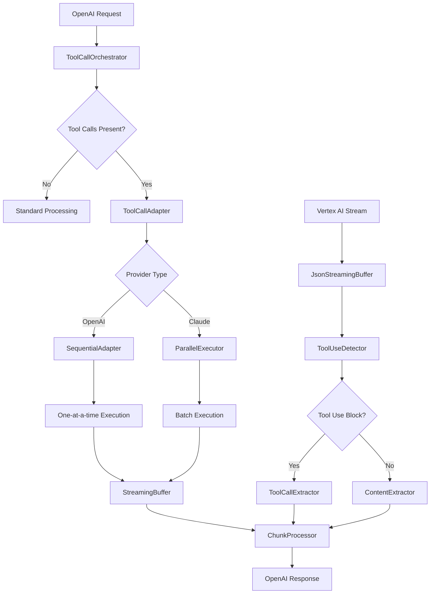

# Streaming Tool Calling Implementation Plan

## Problem Analysis

Based on my analysis of the codebase, I've identified several critical issues with the current streaming and tool calling implementation:

### Core Issues

1. **Streaming Buffer Problem**: Only receiving DONE chunks instead of all content chunks
2. **Tool Calling Semantic Mismatch**: OpenAI vs Claude have fundamentally different tool calling patterns
3. **Incomplete Tool Use Detection**: Current implementation doesn't properly extract `tool_use` blocks from Vertex AI responses
4. **Missing Sequential Tool Call Support**: OpenAI expects one-at-a-time tool calls, Claude supports batches

### Key Differences: OpenAI vs Claude Tool Calling

| Aspect | OpenAI | Claude (Vertex AI) |
|--------|--------|-------------------|
| **Execution Flow** | Sequential: tool_call → result → continue | Batch: multiple tool_use → all results → continue |
| **Streaming** | Stops at tool_call, resumes after result | Can continue streaming after tool_use blocks |
| **Format** | `tool_calls` array in message | `tool_use` blocks in content array |
| **Parallelism** | Not supported natively | Supported - multiple tools in one turn |
| **Error Handling** | New request with error payload | `tool_result` with `is_error: true` |

## Implementation Strategy

### Phase 1: Fix Streaming Buffer (High Priority)

The `JsonStreamingBuffer` needs to properly accumulate and parse incomplete JSON fragments from Vertex AI.

**Current Issue**: The buffer logic in `client.rs` lines 135-210 is not correctly handling fragmented JSON responses.

**Solution**: 
- Enhance the buffer to handle nested JSON objects
- Improve the brace counting logic to handle strings with braces
- Add proper state management for incomplete chunks

### Phase 2: Tool Calling Semantic Adapter

Create an adapter layer that handles the semantic differences between OpenAI and Claude tool calling.

**Key Components**:
- **ToolCallOrchestrator**: Manages the different execution patterns
- **SequentialAdapter**: Converts Claude batches to OpenAI sequential calls
- **ParallelExecutor**: Handles Claude's native parallel execution
- **StateManager**: Tracks tool call state across streaming chunks

### Phase 3: Enhanced Chunk Processing

Update the streaming chunk conversion to properly detect and extract tool calls.

**Current Gap**: `vertex_converter.rs` lines 386-418 has placeholder tool call detection.

**Solution**:
- Implement proper `tool_use` block parsing
- Add tool call state tracking across chunks
- Handle partial tool calls in streaming

### Phase 4: Integration and Testing

Comprehensive testing to ensure the implementation works end-to-end.

## Architecture Diagram



## Implementation Details

### 1. Enhanced JsonStreamingBuffer

```rust
pub struct JsonStreamingBuffer {
    buffer: String,
    brace_depth: i32,
    in_string: bool,
    escaped: bool,
    tool_call_state: ToolCallState,
}

impl JsonStreamingBuffer {
    pub fn add_chunk(&mut self, chunk: &str) -> Vec<ProcessedChunk> {
        // Enhanced logic to handle:
        // 1. Nested JSON objects
        // 2. Tool use blocks
        // 3. Partial content accumulation
    }
}
```

### 2. Tool Call Orchestrator

```rust
pub struct ToolCallOrchestrator {
    adapter: Box<dyn ToolCallAdapter>,
    state_manager: ToolCallStateManager,
}

pub trait ToolCallAdapter {
    fn process_tool_calls(&self, calls: Vec<ToolUse>) -> Result<Vec<ToolCall>>;
    fn execution_pattern(&self) -> ExecutionPattern;
}

pub enum ExecutionPattern {
    Sequential,  // OpenAI style
    Parallel,    // Claude style
}
```

### 3. Streaming Chunk Enhancement

```rust
impl VertexAIConverter {
    fn extract_tool_use_blocks(&self, chunk: &VertexStreamChunk) -> Vec<ToolUse> {
        // Parse content blocks for tool_use type
        // Extract id, name, and input parameters
        // Handle partial tool calls across chunks
    }
    
    fn create_tool_calls_chunk(&self, tool_uses: Vec<ToolUse>) -> Result<ChatCompletionChunk> {
        // Convert Claude tool_use to OpenAI tool_calls format
        // Handle sequential vs parallel execution patterns
    }
}
```

## Testing Strategy

### Unit Tests
- JsonStreamingBuffer with fragmented JSON
- Tool call conversion between formats
- State management across chunks

### Integration Tests
- End-to-end tool calling workflow
- Streaming with tool calls
- Error handling scenarios
- Performance benchmarks

### Manual Testing
- Real Vertex AI integration
- Multiple tool calls in one request
- Tool call continuation scenarios

## Success Criteria

1. **Streaming Works**: All content chunks are properly received and processed
2. **Tool Calls Function**: Both single and multiple tool calls work correctly
3. **OpenAI Compatibility**: Responses match OpenAI API format exactly
4. **Performance**: No significant latency increase
5. **Error Handling**: Graceful handling of malformed tool calls and streaming errors

## Risk Mitigation

### High Risk Items
- **Vertex AI API Changes**: Monitor for breaking changes in tool_use format
- **Performance Impact**: Ensure buffering doesn't add significant latency
- **State Management**: Complex state across streaming chunks

### Mitigation Strategies
- Comprehensive logging for debugging
- Fallback mechanisms for parsing failures
- Performance monitoring and optimization
- Extensive test coverage

## Timeline Estimate

- **Phase 1 (Streaming Fix)**: 2-3 days
- **Phase 2 (Tool Adapter)**: 3-4 days  
- **Phase 3 (Chunk Processing)**: 2-3 days
- **Phase 4 (Testing)**: 2-3 days

**Total**: 9-13 days

## Dependencies

- Access to Vertex AI for testing
- Understanding of exact Vertex AI response format
- OpenAI API specification compliance
- Performance requirements definition

## Next Steps

1. Start with Phase 1 - fix the streaming buffer issue
2. Create comprehensive test cases for tool calling scenarios
3. Implement the tool call orchestrator
4. Integrate and test end-to-end functionality