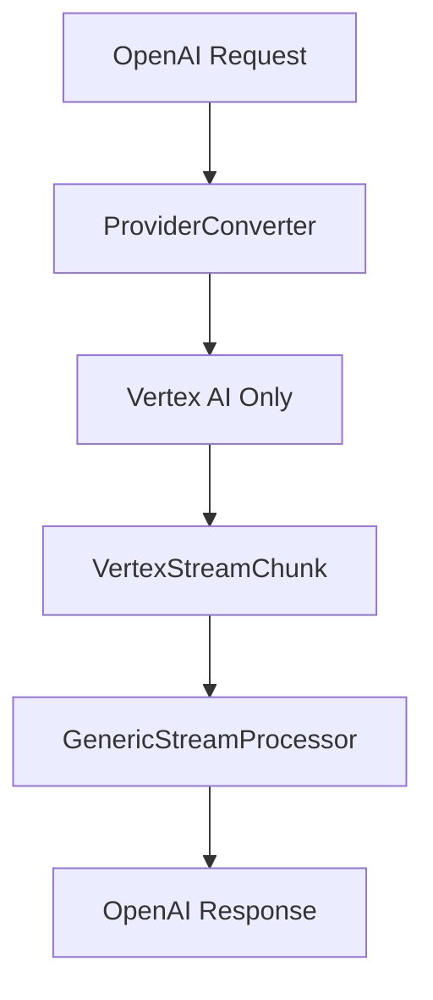
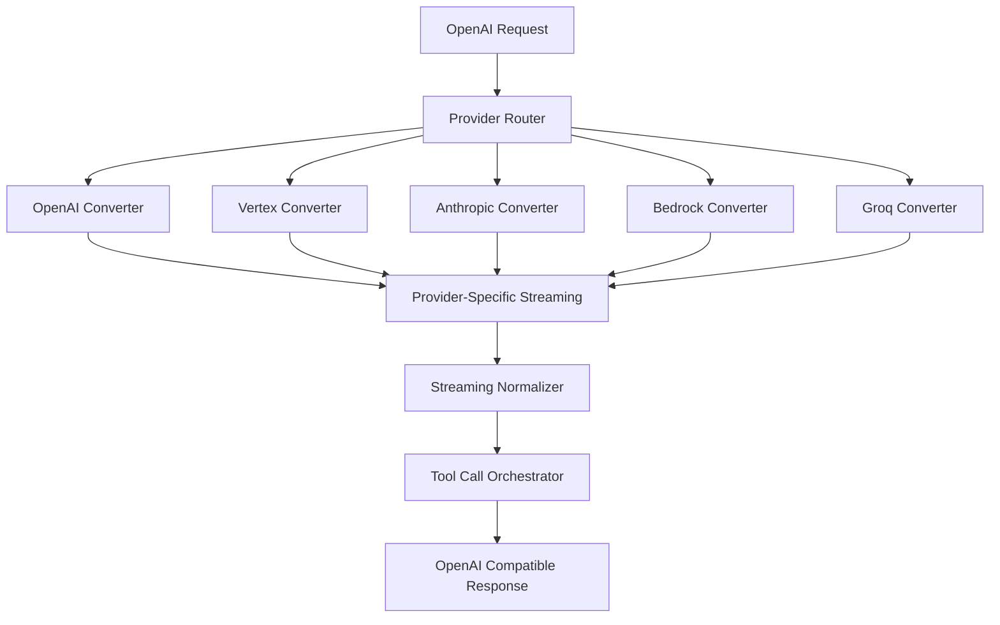

# Tool Calling Compliance Analysis: OpenAI API Compatibility Assessment

## Executive Summary

This document analyzes the current implementation of normalized tool calling in the llm-supabase-rs proxy against the OpenAI API specification and the provided streaming behavior cheat sheet. The analysis reveals that while the proxy has a solid foundation for tool calling, there are several gaps in full OpenAI API compliance, particularly around streaming behavior and multi-provider normalization.

## Current Implementation Status

### ✅ Strengths

1. **Unified Tool Calling Interface**: The codebase has a well-designed `ToolCallManager` and `UnifiedToolCall` abstraction that handles provider differences.

2. **Vertex AI Integration**: Strong implementation for Vertex AI (Claude models) with proper tool conversion between OpenAI and Claude formats.

3. **Comprehensive Testing**: Good test coverage with both TypeScript E2E tests and Rust integration tests.

4. **Streaming Infrastructure**: Basic streaming support exists with `GenericStreamProcessor` and provider-specific converters.

5. **Client Detection**: Adaptive formatting based on client SDK detection (modern vs legacy).

### ❌ Critical Gaps

1. **Incomplete Provider Coverage**: Only Vertex AI is fully implemented - missing OpenAI, Groq, Anthropic Direct, Bedrock, etc.

2. **Streaming Tool Call Normalization**: Current streaming implementation doesn't properly handle the complex tool call streaming patterns described in the cheat sheet.

3. **Provider-Specific Streaming Behavior**: Missing the nuanced streaming behavior differences between providers (token-by-token vs complete blocks).

4. **Tool Call Continuation Logic**: No implementation of the "second request" pattern required by most providers after tool execution.

## Detailed Analysis Against OpenAI Specification

### Tool Call Formats

| Aspect | Current Status | OpenAI Requirement | Gap |
|--------|----------------|-------------------|-----|
| Modern `tool_calls` array | ✅ Implemented | ✅ Required | None |
| Legacy `function_call` | ✅ Implemented | ✅ Required for compatibility | None |
| Tool call IDs | ✅ Implemented | ✅ Required | None |
| Arguments as JSON strings | ✅ Implemented | ✅ Required | None |

### Streaming Behavior

| Provider | Current Implementation | Required Behavior | Compliance Status |
|----------|----------------------|-------------------|-------------------|
| OpenAI | ❌ Not implemented | Token-by-token → single `function_call` delta → stream ends | **Missing** |
| Vertex AI | ⚠️ Partial | Text parts → single `functionCall` part → stream ends → new request | **Incomplete** |
| Groq | ❌ Not implemented | Same as OpenAI | **Missing** |
| Anthropic Direct | ❌ Not implemented | Text parts → single `tool_use` block → stream ends | **Missing** |
| Bedrock | ❌ Not implemented | JSON lines → single `toolUse` object → stream ends | **Missing** |

### Critical Missing Patterns

1. **Stream Termination**: The proxy doesn't properly close streams after tool calls as required by OpenAI spec.

2. **Tool Call Continuation**: Missing the "second request" pattern where tool results are sent back to continue the conversation.

3. **Provider-Specific Normalization**: The streaming processor is too generic and doesn't handle provider-specific quirks.

## Architecture Assessment

### Current Architecture

### Required Architecture

## Streaming Behavior Compliance Matrix

Based on the provided cheat sheet, here's how each provider should be handled:

### OpenAI/Groq/Together/Fireworks
- **Current**: ❌ Not implemented
- **Required**: Pass-through SSE until `finish_reason="function_call"`, close stream immediately
- **Gap**: Complete implementation missing

### Vertex AI (Gemini/Claude)
- **Current**: ⚠️ Basic implementation exists
- **Required**: Buffer text parts, emit single `functionCall`, close stream, start new request with `toolResponses`
- **Gap**: Missing proper stream closure and continuation logic

### Anthropic Direct
- **Current**: ❌ Not implemented  
- **Required**: Buffer text, emit single `tool_use` block, close on `stop_reason:"tool_use"`
- **Gap**: Complete implementation missing

### AWS Bedrock
- **Current**: ❌ Not implemented
- **Required**: Read JSON lines until `stopReason:"tool_use"`, emit complete `toolUse` object
- **Gap**: Complete implementation missing

## Test Coverage Analysis

### Existing Tests
- ✅ Basic tool calling (non-streaming)
- ✅ Legacy function calling
- ✅ Tool choice variations
- ✅ Error handling
- ✅ Client SDK detection
- ⚠️ Basic streaming (incomplete)

### Missing Tests
- ❌ Provider-specific streaming behavior
- ❌ Tool call continuation flows
- ❌ Multi-provider compatibility
- ❌ Stream termination compliance
- ❌ Edge cases from cheat sheet

## Performance Considerations

### Current Performance Issues
1. **Generic Processing**: The current `GenericStreamProcessor` is inefficient for provider-specific optimizations
2. **Missing Parallel Execution**: Tool calls aren't executed in parallel as they could be
3. **No Caching**: No caching of provider responses or tool results

### Required Optimizations
1. **Provider-Specific Processors**: Each provider needs optimized streaming logic
2. **Parallel Tool Execution**: Implement the orchestrator's parallel execution properly
3. **Connection Pooling**: Reuse connections for tool call continuations

## Security and Compliance

### Current Security
- ✅ Input validation exists
- ✅ Error handling prevents information leakage
- ✅ Authentication for Vertex AI

### Missing Security Features
- ❌ Rate limiting per provider
- ❌ Tool execution sandboxing
- ❌ Request/response sanitization
- ❌ Audit logging for tool calls

## Recommendations

### Priority 1 (Critical)
1. Implement complete streaming normalization per the cheat sheet
2. Add support for OpenAI, Anthropic Direct, and Bedrock providers
3. Fix tool call continuation logic
4. Ensure proper stream termination

### Priority 2 (Important)
1. Add comprehensive streaming tests for each provider
2. Implement provider-specific optimizations
3. Add proper error handling and retries
4. Implement rate limiting and security features

### Priority 3 (Enhancement)
1. Add performance monitoring and metrics
2. Implement caching strategies
3. Add support for additional providers (Together AI, Fireworks, etc.)
4. Optimize for high-throughput scenarios

## Conclusion

The llm-supabase-rs proxy has a solid foundation but requires significant work to achieve full OpenAI API compliance. The most critical gaps are:

1. **Multi-provider support**: Currently only Vertex AI is implemented
2. **Streaming compliance**: The streaming behavior doesn't match OpenAI specifications
3. **Tool call continuation**: Missing the second-request pattern required by most providers

The provided streaming behavior cheat sheet should serve as the definitive specification for implementing proper normalization across all providers. The architecture needs to be extended to support provider-specific streaming processors while maintaining the unified OpenAI-compatible interface.

**Estimated effort**: 3-4 weeks for full compliance implementation
**Risk level**: Medium (existing architecture is sound, but significant new code required)
**Business impact**: High (full OpenAI compatibility enables broader adoption)