# Universal AI Voice & Real-Time Knowledge Platform

**Project:** llm-supabase-rs (Enhanced)  
**Version:** 3.0 - Voice & Real-Time Features  
**Date:** October 2, 2025

---

## Executive Summary

This document specifies the evolution of the Universal AI Server Proxy into a comprehensive **Voice AI and Real-Time Knowledge Platform** that combines:

1. **Voice AI Assistant** - Real-time conversational AI with any LLM backend
2. **LiveKit Agent Mode** - Joins calls as an AI participant for transcription, Q&A, and real-time knowledge retrieval
3. **Live Stream Enhancement** - AI-powered presentations, podcasts, and events with real-time Q&A from knowledge bases
4. **Omi.me Integration** - Medical transcription backend supporting custom Flutter app for healthcare professionals
5. **Real-Time Vector Embedding** - Continuous knowledge base updates from live streams

**Unique Value Proposition:**

> One Rust Server. Multiple Real-Time AI Capabilities.
>
> - ✅ Voice conversations (user → AI)
> - ✅ AI agent in calls (joins as participant)
> - ✅ Live transcription + embedding
> - ✅ Real-time knowledge Q&A
> - ✅ Any LLM backend (9+ providers)
> - ✅ Omi.me API compatible
> - ✅ Self-hosted option

---

## Use Cases & Market Opportunity

### 1. Live Events & Webinars

**Scenario:** Technical conference presentation with real-time AI Q&A

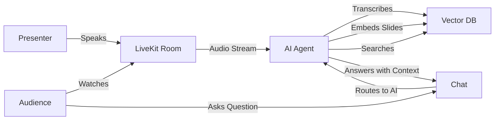

**Value:**

- Audience gets instant answers from presentation content
- Presenter doesn't interrupt flow
- Questions answered with citations from slides/transcript
- **Market:** $2B event technology market

### 2. Medical Consultations (Omi.me)

**Scenario:** Doctor-patient consultation with real-time clinical support

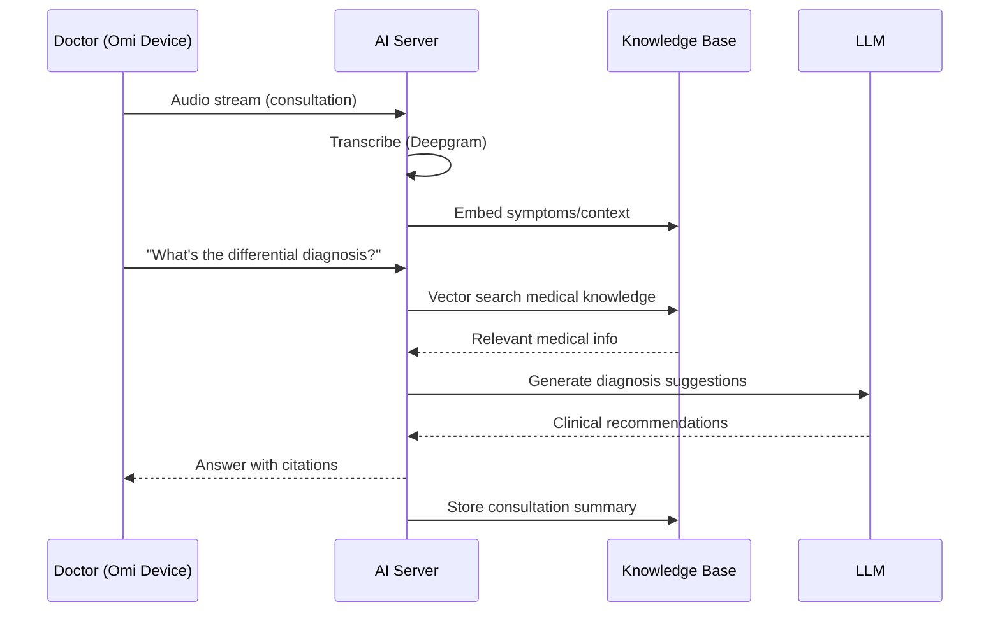

**Value:**

- Real-time clinical decision support
- Automatic consultation documentation
- Patient history knowledge base
- HIPAA-compliant self-hosted option
- **Market:** $10B healthcare AI market

### 3. Podcast Recording & Enhancement

**Scenario:** Podcast with AI co-host and real-time fact-checking

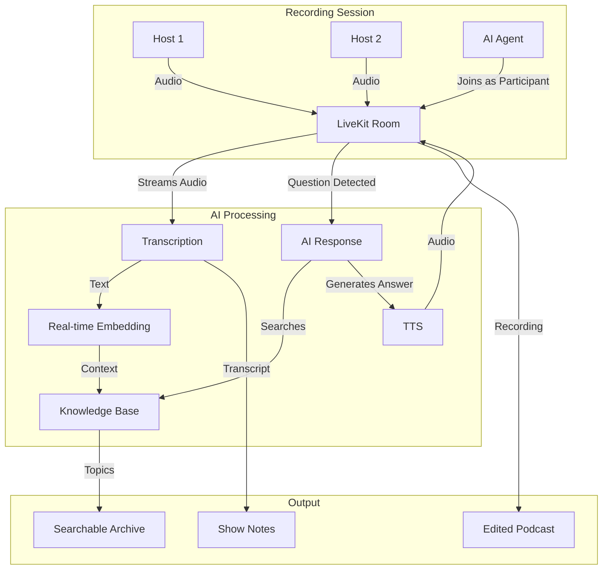

**Value:**

- AI participates naturally in conversation
- Automatic show notes and timestamps
- Searchable podcast archive with semantic search
- **Market:** $2B podcast industry

### 4. Customer Support Training

**Scenario:** Training session with live feedback

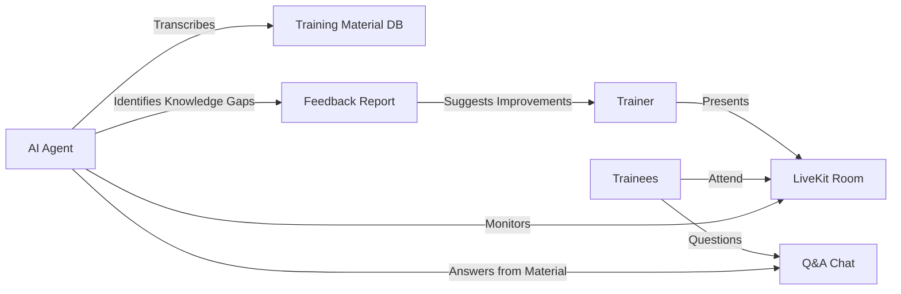

**Value:**

- Instant answers from training materials
- Identifies common questions/confusion points
- Continuous improvement of training content
- **Market:** $300B corporate training market

---

## System Architecture

### High-Level Overview

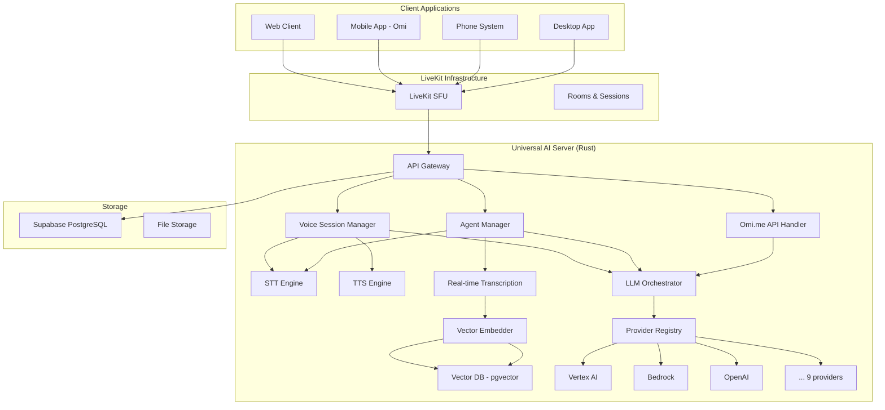

### Data Flow Architecture

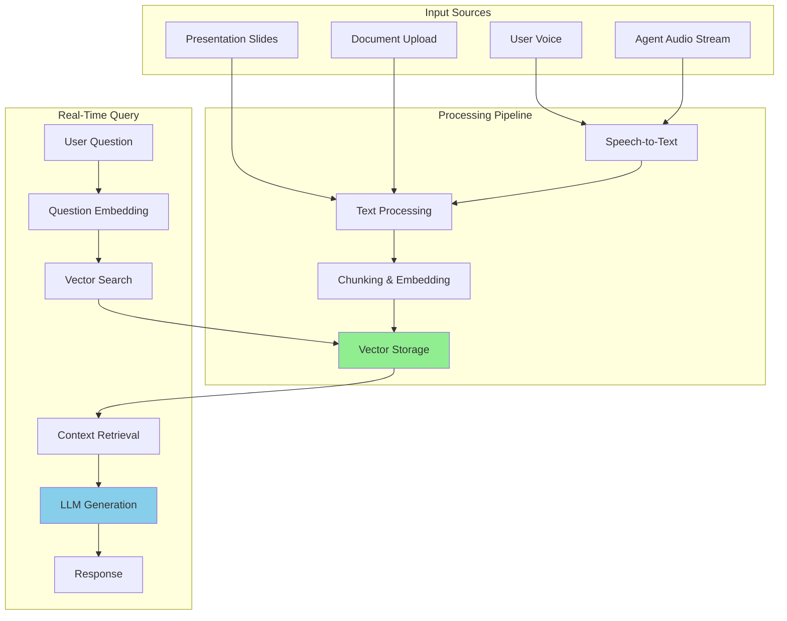

---

## Core Features

### Feature Matrix

| Feature                 | Voice Chat | Agent Mode | Omi.me | Live Stream |
| ----------------------- | ---------- | ---------- | ------ | ----------- |
| Real-time transcription | ✅          | ✅          | ✅      | ✅           |
| Voice synthesis         | ✅          | ✅          | ✅      | ✅           |
| Multi-LLM support       | ✅          | ✅          | ✅      | ✅           |
| Vector search           | ✅          | ✅          | ✅      | ✅           |
| Joins as participant    | ❌          | ✅          | ❌      | ✅           |
| Document embedding      | ✅          | ✅          | ✅      | ✅           |
| Real-time Q&A           | ✅          | ✅          | ✅      | ✅           |
| Omi.me API              | ❌          | ❌          | ✅      | ❌           |
| Medical features        | ❌          | ❌          | ✅      | ❌           |
| Recording               | ✅          | ✅          | ✅      | ✅           |
| Self-hosted             | ✅          | ✅          | ✅      | ✅           |

---

## LiveKit Agent Mode

### Agent Architecture

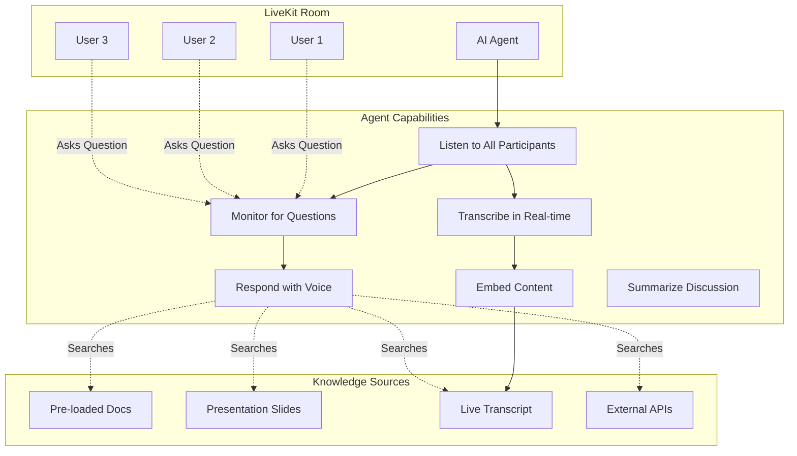

### Agent Modes

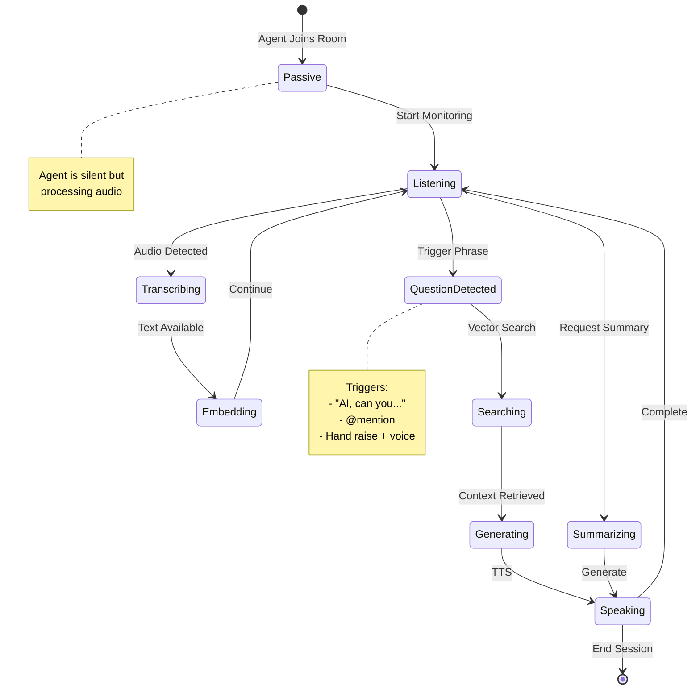

### Agent Implementation

**Key Components:**

1. **Agent Join Flow**

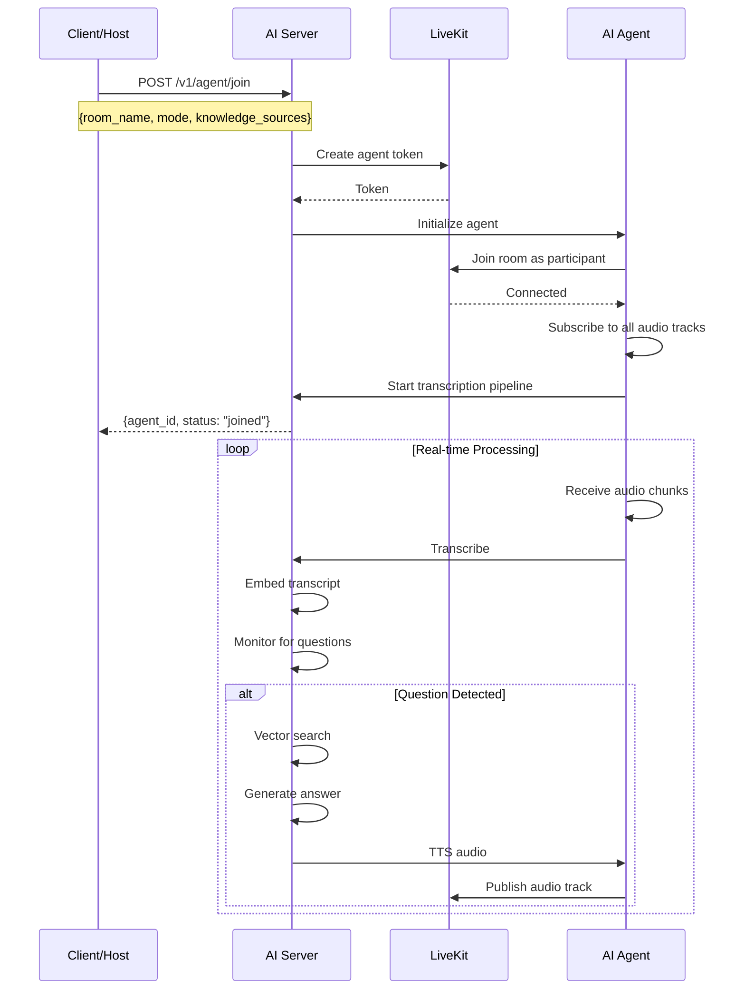

2. **Activation Patterns**

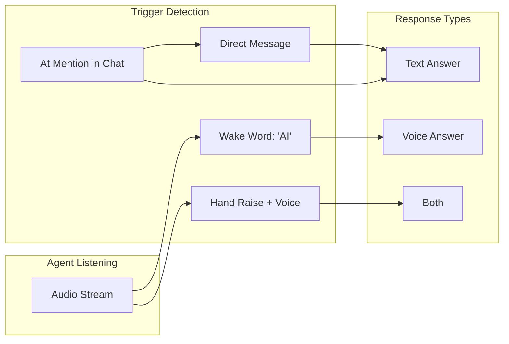

---

## Real-Time Knowledge System

### Vector Embedding Pipeline

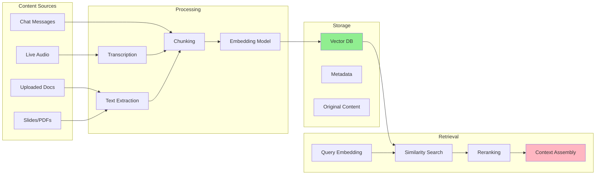

### Knowledge Base Structure

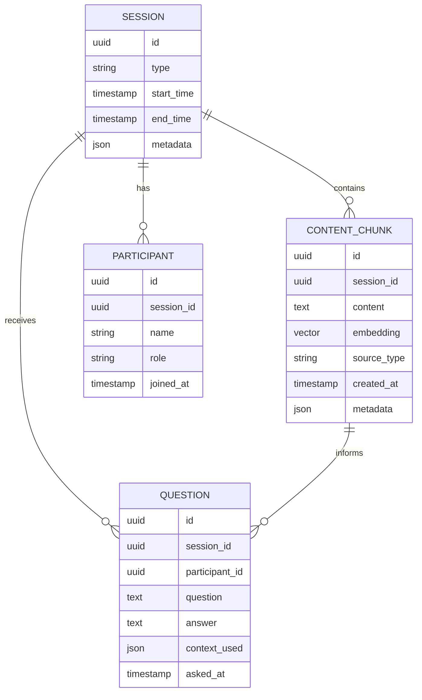

### Semantic Search Flow

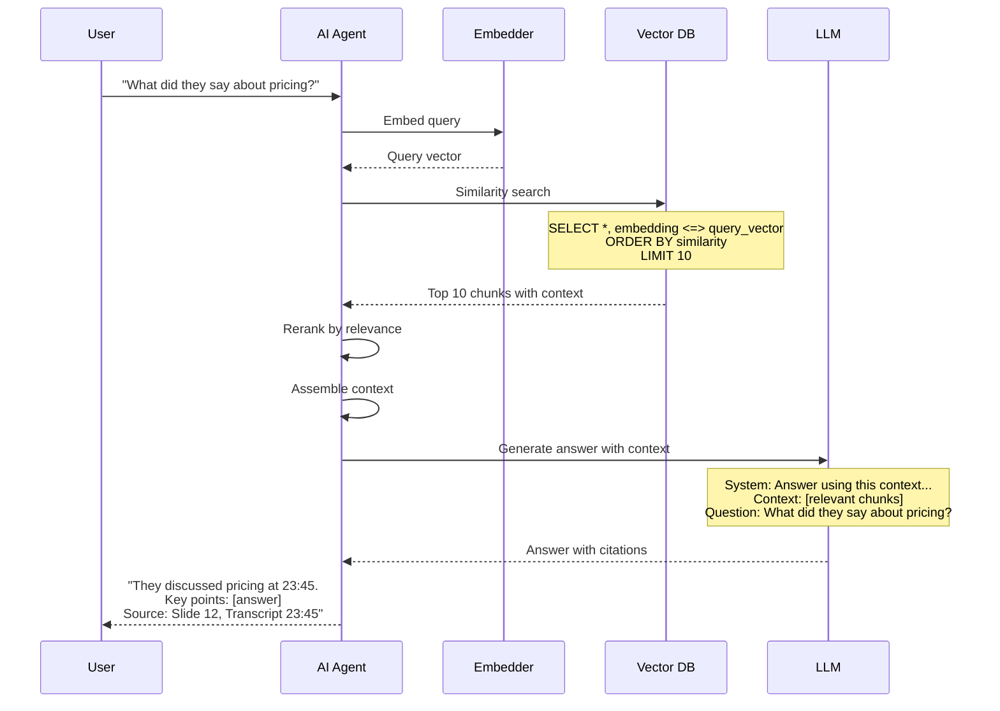

---

## Omi.me Integration

### Omi.me Overview

**What is Omi.me?**

- Open-source wearable AI device (necklace)
- Continuous audio recording
- Privacy-focused (user owns data)
- Backend API for transcription & processing
- Flutter mobile app

**Your Integration Goal:**
Build the backend server that the custom Omi Flutter app connects to for medical consultations.

### Omi.me Architecture

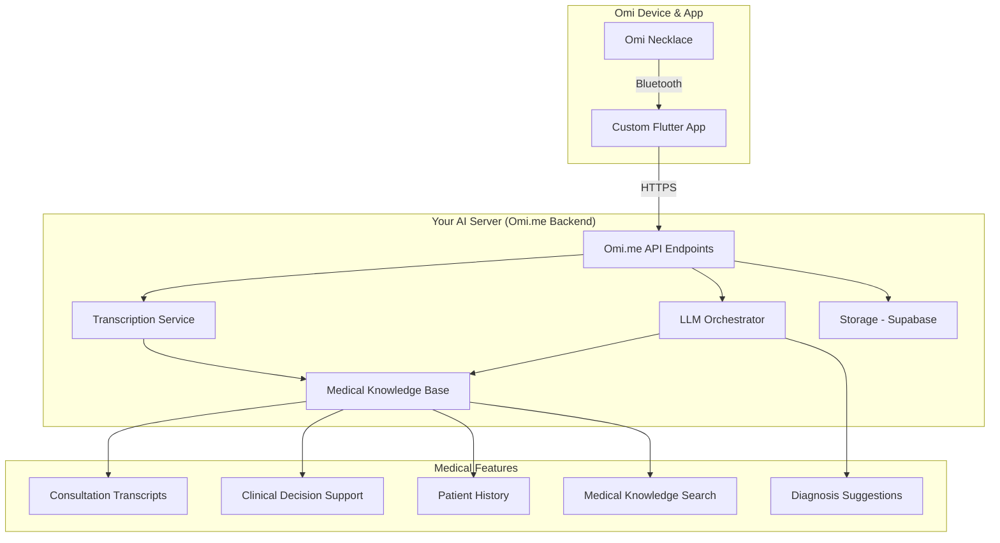

### Omi.me API Specification

**Endpoints to Implement:**

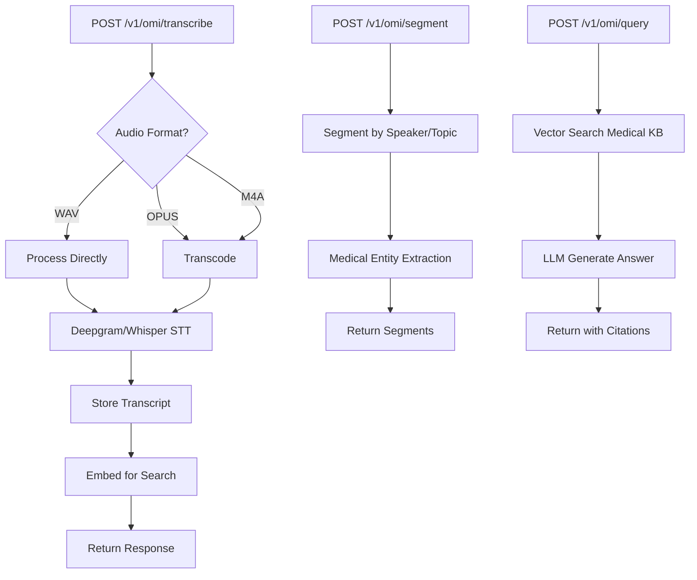

**API Request/Response Examples:**

1. **Transcribe Consultation**

```json
POST /v1/omi/transcribe
Content-Type: multipart/form-data

{
  "audio": <binary>,
  "format": "opus",
  "metadata": {
    "doctor_id": "uuid",
    "patient_id": "uuid",
    "consultation_id": "uuid",
    "timestamp": "2025-10-02T10:00:00Z"
  }
}

Response:
{
  "transcription": {
    "text": "Patient reports chest pain for 3 days...",
    "segments": [
      {
        "speaker": "doctor",
        "text": "Can you describe the pain?",
        "start": 0.0,
        "end": 2.5
      },
      {
        "speaker": "patient",
        "text": "It's a sharp pain on the left side",
        "start": 3.0,
        "end": 5.5
      }
    ],
    "duration": 180.5,
    "language": "en"
  },
  "entities": {
    "symptoms": ["chest pain"],
    "duration": ["3 days"],
    "characteristics": ["sharp", "left side"]
  },
  "consultation_id": "uuid",
  "stored": true
}
```

2. **Clinical Query**

```json
POST /v1/omi/query
{
  "consultation_id": "uuid",
  "question": "What are the differential diagnoses?",
  "context": {
    "include_history": true,
    "include_guidelines": true,
    "specialty": "cardiology"
  }
}

Response:
{
  "answer": "Based on the symptoms (chest pain, sharp, left side, 3 days duration), differential diagnoses include...",
  "sources": [
    {
      "type": "consultation",
      "timestamp": "2025-10-02T10:05:00Z",
      "content": "Patient reports chest pain...",
      "relevance": 0.95
    },
    {
      "type": "medical_guideline",
      "title": "AHA Chest Pain Guidelines",
      "content": "Sharp chest pain may indicate...",
      "relevance": 0.87
    }
  ],
  "suggested_tests": [
    "ECG",
    "Troponin levels",
    "Chest X-ray"
  ],
  "confidence": 0.82
}
```

3. **Real-time Session**

```json
POST /v1/omi/session/start
{
  "doctor_id": "uuid",
  "patient_id": "uuid",
  "session_type": "consultation"
}

Response:
{
  "session_id": "uuid",
  "websocket_url": "wss://server/v1/omi/ws/uuid",
  "livekit_token": "eyJhbGc...",
  "expires_at": "2025-10-02T12:00:00Z"
}

// WebSocket messages
{
  "type": "transcription",
  "data": {
    "text": "Patient reports...",
    "speaker": "patient",
    "timestamp": 1234567890
  }
}

{
  "type": "suggestion",
  "data": {
    "type": "clinical_note",
    "content": "Consider asking about family history",
    "confidence": 0.75
  }
}
```

### Medical Knowledge Base

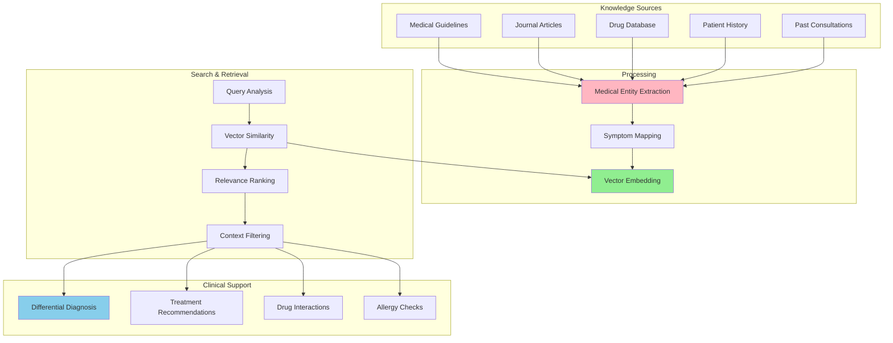

---

## Technical Implementation

### Module Structure

```
src/
├── api/
│   ├── handlers/
│   │   ├── voice.rs (existing)
│   │   ├── agent.rs (NEW)
│   │   ├── omi.rs (NEW)
│   │   └── knowledge.rs (NEW)
│   └── websocket/
│       ├── agent_ws.rs (NEW)
│       └── omi_ws.rs (NEW)
│
├── domain/
│   ├── models/
│   │   ├── agent.rs (NEW)
│   │   ├── session.rs (NEW)
│   │   ├── knowledge.rs (NEW)
│   │   └── medical.rs (NEW)
│   └── services/
│       ├── agent_orchestrator.rs (NEW)
│       ├── knowledge_manager.rs (NEW)
│       └── medical_processor.rs (NEW)
│
├── infrastructure/
│   ├── voice/ (existing)
│   ├── agent/ (NEW)
│   │   ├── livekit_agent.rs
│   │   ├── activation_detector.rs
│   │   └── agent_controller.rs
│   ├── knowledge/ (NEW)
│   │   ├── embedder.rs
│   │   ├── vector_store.rs
│   │   ├── chunker.rs
│   │   └── reranker.rs
│   ├── medical/ (NEW)
│   │   ├── entity_extractor.rs
│   │   ├── clinical_knowledge.rs
│   │   └── omi_api.rs
│   └── realtime/ (NEW)
│       ├── transcription_stream.rs
│       └── embedding_stream.rs
```

### Key Dependencies

```toml
[dependencies]
# Existing core dependencies
axum = "0.7"
tokio = { version = "1.0", features = ["full"] }
# ... all existing deps

# NEW: LiveKit Agent
livekit = "0.3"
livekit-api = "0.3"

# NEW: Vector Database
pgvector = "0.3"
sqlx = { version = "0.7", features = ["postgres", "uuid", "chrono"] }

# NEW: Embedding Models
fastembed = "3.0"  # Fast local embeddings
# Or use API-based:
# openai-api = "0.1"  # For OpenAI embeddings

# NEW: Audio Processing
symphonia = "0.5"
rubato = "0.15"
hound = "3.5"

# NEW: Medical NLP (optional, for entity extraction)
rust-bert = "0.21"  # For medical entity extraction
```

### Core Implementation: LiveKit Agent

```rust
// src/infrastructure/agent/livekit_agent.rs

pub struct LiveKitAgent {
    agent_id: Uuid,
    room: Room,
    mode: AgentMode,
    capabilities: AgentCapabilities,
    state: Arc<RwLock<AgentState>>,
    
    // Processing components
    transcriber: Arc<dyn SpeechToText>,
    embedder: Arc<KnowledgeEmbedder>,
    llm_orchestrator: Arc<RequestProcessor>,
    knowledge_manager: Arc<KnowledgeManager>,
    
    // Audio
    audio_receiver: AudioStream,
    audio_sender: AudioStream,
}

#[derive(Debug, Clone)]
pub enum AgentMode {
    Passive,        // Only transcribe and embed
    Active,         // Respond to questions
    Proactive,      // Offer suggestions
    Moderator,      // Manage discussion flow
}

#[derive(Debug, Clone)]
pub struct AgentCapabilities {
    pub transcription: bool,
    pub voice_response: bool,
    pub text_response: bool,
    pub knowledge_search: bool,
    pub real_time_embedding: bool,
    pub summarization: bool,
}

impl LiveKitAgent {
    pub async fn join_room(
        room_name: &str,
        mode: AgentMode,
        config: AgentConfig,
    ) -> Result<Self> {
        // Generate agent token
        let token = Self::generate_agent_token(room_name, &config).await?;
        
        // Connect to room
        let room = Room::connect(
            &config.livekit_url,
            &token,
            RoomOptions::default(),
        ).await?;
        
        // Subscribe to all participant audio
        let audio_receiver = Self::subscribe_to_all_audio(&room).await?;
        
        // Create agent audio track
        let audio_sender = room.local_participant()
            .create_audio_track("ai-agent-voice")
            .await?;
        
        let agent = Self {
            agent_id: Uuid::new_v4(),
            room,
            mode,
            capabilities: config.capabilities,
            state: Arc::new(RwLock::new(AgentState::Listening)),
            transcriber: config.transcriber,
            embedder: config.embedder,
            llm_orchestrator: config.llm_orchestrator,
            knowledge_manager: config.knowledge_manager,
            audio_receiver,
            audio_sender,
        };
        
        // Start processing loops
        tokio::spawn(agent.clone().transcription_loop());
        tokio::spawn(agent.clone().embedding_loop());
        tokio::spawn(agent.clone().question_detection_loop());
        
        Ok(agent)
    }
    
    async fn transcription_loop(self) {
        let mut transcript_buffer = String::new();
        
        while let Some(audio_chunk) = self.audio_receiver.recv().await {
            // Transcribe chunk
            let transcript = self.transcriber
                .transcribe_stream(audio_chunk)
                .await
                .unwrap();
            
            for chunk in transcript {
                transcript_buffer.push_str(&chunk.text);
                
                // Emit real-time transcript
                self.emit_transcript_event(&chunk).await;
                
                // Check for sentence completion
                if chunk.is_final && Self::is_sentence_end(&transcript_buffer) {
                    // Pass to embedding pipeline
                    self.embedder
                        .embed_and_store(&transcript_buffer, &self.agent_id)
                        .await
                        .unwrap();
                    
                    transcript_buffer.clear();
                }
            }
        }
    }
    
    async fn question_detection_loop(self) {
        // Monitor transcripts for questions directed at agent
        let mut rx = self.knowledge_manager.transcript_rx.subscribe();
        
        while let Ok(transcript) = rx.recv().await {
            // Check activation patterns
            if Self::is_agent_activated(&transcript.text) {
                // Extract question
                let question = Self::extract_question(&transcript.text);
                
                // Update state
                *self.state.write().await = AgentState::Processing;
                
                // Search knowledge base
                let context = self.knowledge_manager
                    .search(&question, &self.agent_id)
                    .await
                    .unwrap();
                
                // Generate answer
                let answer = self.llm_orchestrator
                    .generate_answer(&question, &context)
                    .await
                    .unwrap();
                
                // Respond based on mode
                match self.mode {
                    AgentMode::Active => {
                        self.speak_answer(&answer).await.unwrap();
                    }
                    _ => {
                        self.send_text_answer(&answer).await.unwrap();
                    }
                }
                
                // Back to listening
                *self.state.write().await = AgentState::Listening;
            }
        }
    }
    
    async fn speak_answer(&self, text: &str) -> Result<()> {
        // Convert text to speech
        let audio = self.tts.synthesize(text).await?;
        
        // Send to LiveKit
        self.audio_sender.send_audio(&audio).await?;
        
        Ok(())
    }
    
    fn is_agent_activated(text: &str) -> bool {
        let text_lower = text.to_lowercase();
        
        // Activation patterns
        text_lower.contains("ai,") ||
        text_lower.contains("hey ai") ||
        text_lower.contains("@ai") ||
        text_lower.contains("assistant,")
    }
}
```

### Core Implementation: Real-Time Knowledge

```rust
// src/infrastructure/knowledge/embedder.rs

pub struct KnowledgeEmbedder {
    embedding_model: Arc<dyn EmbeddingProvider>,
    vector_store: Arc<VectorStore>,
    chunker: TextChunker,
}

impl KnowledgeEmbedder {
    pub async fn embed_and_store(
        &self,
        content: &str,
        session_id: &Uuid,
    ) -> Result<Vec<Uuid>> {
        // Chunk content
        let chunks = self.chunker.chunk(content)?;
        
        let mut chunk_ids = Vec::new();
        
        for chunk in chunks {
            // Generate embedding
            let embedding = self.embedding_model
                .generate_embeddings(vec![chunk.text.clone()])
                .await?;
            
            // Store in vector DB
            let chunk_id = self.vector_store
                .store_chunk(ContentChunk {
                    id: Uuid::new_v4(),
                    session_id: *session_id,
                    content: chunk.text,
                    embedding: embedding[0].clone(),
                    source_type: "transcript".to_string(),
                    metadata: json!({
                        "timestamp": Utc::now(),
                        "chunk_index": chunk.index,
                    }),
                })
                .await?;
            
            chunk_ids.push(chunk_id);
        }
        
        Ok(chunk_ids)
    }
}

// src/infrastructure/knowledge/vector_store.rs

pub struct VectorStore {
    pool: PgPool,
}

impl VectorStore {
    pub async fn store_chunk(&self, chunk: ContentChunk) -> Result<Uuid> {
        let id = sqlx::query_scalar!(
            r#"
            INSERT INTO content_chunks (
                id, session_id, content, embedding, source_type, metadata
            )
            VALUES ($1, $2, $3, $4, $5, $6)
            RETURNING id
            "#,
            chunk.id,
            chunk.session_id,
            chunk.content,
            chunk.embedding.as_slice(),
            chunk.source_type,
            chunk.metadata
        )
        .fetch_one(&self.pool)
        .await?;
        
        Ok(id)
    }
    
    pub async fn search(
        &self,
        query_embedding: &[f32],
        session_id: &Uuid,
        limit: i64,
    ) -> Result<Vec<SearchResult>> {
        let results = sqlx::query_as!(
            SearchResult,
            r#"
            SELECT 
                id,
                content,
                source_type,
                metadata,
                1 - (embedding <=> $1::vector) as similarity
            FROM content_chunks
            WHERE session_id = $2
            ORDER BY embedding <=> $1::vector
            LIMIT $3
            "#,
            query_embedding,
            session_id,
            limit
        )
        .fetch_all(&self.pool)
        .await?;
        
        Ok(results)
    }
}
```

---

## API Specification

### REST Endpoints

```
# Agent Management
POST   /v1/agent/create        - Create agent configuration
POST   /v1/agent/join          - Join agent to room
GET    /v1/agent/{id}/status   - Get agent status
DELETE /v1/agent/{id}          - Remove agent from room
POST   /v1/agent/{id}/command  - Send command to agent

# Knowledge Base
POST   /v1/knowledge/upload    - Upload documents
POST   /v1/knowledge/embed     - Embed content
POST   /v1/knowledge/search    - Semantic search
GET    /v1/knowledge/session/{id} - Get session knowledge

# Omi.me API
POST   /v1/omi/transcribe      - Transcribe audio
POST   /v1/omi/segment         - Segment by speaker
POST   /v1/omi/query           - Medical query
POST   /v1/omi/session/start   - Start consultation
POST   /v1/omi/session/end     - End consultation
GET    /v1/omi/history/{patient_id} - Get patient history

# WebSocket
WS     /v1/agent/ws/{id}       - Agent real-time events
WS     /v1/omi/ws/{session_id} - Omi real-time session
```

---

## Implementation Roadmap

### Phase 1: Foundation Enhancement (4 weeks)

**Week 1-2: LiveKit Agent Core**

- [ ] Agent join/leave room functionality
- [ ] Multi-participant audio subscription
- [ ] Agent audio publishing
- [ ] Basic activation detection
- [ ] Simple Q&A with existing LLM

**Week 3-4: Vector Knowledge Base**

- [ ] pgvector integration
- [ ] Real-time embedding pipeline
- [ ] Semantic search implementation
- [ ] Context retrieval and ranking
- [ ] Knowledge base CRUD API

**Deliverable:** Agent that joins LiveKit rooms, transcribes, and answers basic questions

### Phase 2: Advanced Agent (4 weeks)

**Week 5-6: Agent Modes & Capabilities**

- [ ] Passive/Active/Proactive modes
- [ ] Activation pattern detection
- [ ] Voice response via TTS
- [ ] Concurrent multi-room support
- [ ] Agent state management

**Week 7-8: Real-Time Processing**

- [ ] Streaming transcription
- [ ] Streaming embedding
- [ ] Real-time context updates
- [ ] Question queue management
- [ ] Response prioritization

**Deliverable:** Full-featured agent with multiple modes and real-time knowledge updates

### Phase 3: Omi.me Integration (4 weeks)

**Week 9-10: Omi.me API**

- [ ] Omi.me endpoint implementation
- [ ] Audio format handling (OPUS, M4A, WAV)
- [ ] Speaker diarization
- [ ] Medical entity extraction
- [ ] Consultation storage

**Week 11-12: Medical Features**

- [ ] Medical knowledge base
- [ ] Clinical decision support
- [ ] Patient history integration
- [ ] Diagnosis suggestions
- [ ] Drug interaction checking

**Deliverable:** Working Omi.me backend for medical consultations

### Phase 4: Production Ready (4 weeks)

**Week 13-14: Performance & Scale**

- [ ] Connection pooling optimization
- [ ] Embedding batch processing
- [ ] Caching layer
- [ ] Load testing
- [ ] Resource optimization

**Week 15-16: Polish & Deploy**

- [ ] Documentation
- [ ] Example applications
- [ ] Deployment guides
- [ ] Security audit
- [ ] HIPAA compliance (Omi.me)

**Deliverable:** Production-ready platform with all features

---

## Success Metrics

### Technical Metrics

- Agent join latency: < 2s
- Transcription delay: < 500ms
- Embedding latency: < 200ms
- Search response time: < 100ms
- End-to-end Q&A latency: < 2s
- Concurrent agents: 100+
- Concurrent rooms: 50+

### Business Metrics

- Medical consultations: 1,000+/month
- Live events enhanced: 100+/month
- Knowledge base size: 1M+ chunks
- Query accuracy: >85%
- User satisfaction: >4.5/5

---

## Conclusion

This platform combines voice AI, real-time knowledge processing, and specialized medical features into one unified Rust server. The architecture enables:

1. **Versatility** - Multiple use cases from one codebase
2. **Performance** - Rust + async for high concurrency
3. **Privacy** - Self-hosted option for sensitive data
4. **Extensibility** - Plugin architecture for new features
5. **Cost Efficiency** - Single server, multiple capabilities

**Market Position:** The only platform combining voice AI, LiveKit agent mode, real-time knowledge, and Omi.me medical integration with multi-LLM support.

**Timeline:** 16 weeks to production-ready platform  
**Investment:** $150K-250K (dev + infrastructure)  
**Revenue Potential:** $2-5M ARR within 18 months