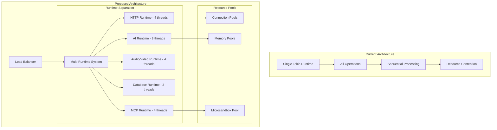

# Threading Architecture Documentation

**Project:** llm-supabase-rs  
**Version:** 3.0 - Performance Optimized  
**Date:** October 3, 2025

---

## Overview

This directory contains comprehensive documentation for the high-performance threading architecture designed to transform the Universal AI Server Proxy into a platform capable of supporting real-time AI video processing, LiveKit integration, and massive concurrent workloads.

## Documents

### 1. [THREADING_ARCHITECTURE.md](./THREADING_ARCHITECTURE.md)
**Purpose:** Complete technical specification of the multi-runtime threading architecture

**Key Topics:**
- Multi-runtime design with specialized thread pools
- Connection pooling and resource management
- Memory pool management for zero-copy operations
- Microsandbox integration for secure execution
- Real-time audio/video processing pipeline

### 2. [IMPLEMENTATION_PLAN.md](./IMPLEMENTATION_PLAN.md)
**Purpose:** Detailed 8-week implementation roadmap with specific deliverables

**Key Topics:**
- Phase-by-phase implementation strategy
- Performance targets and success metrics
- Required dependencies and configuration
- Migration strategy from current architecture

### 3. [PERFORMANCE_BENCHMARKS.md](./PERFORMANCE_BENCHMARKS.md)
**Purpose:** Benchmarking methodology and performance optimization guide

**Key Topics:**
- Load testing scenarios and frameworks
- Performance profiling and debugging tools
- Continuous performance monitoring
- Deployment optimization strategies

---

## Architecture Summary

### Current vs. Proposed Architecture

### Performance Improvements Expected

| Metric | Current | Target | Improvement |
|--------|---------|--------|-------------|
| **Concurrent Requests** | 1,000 | 5,000 | 5x |
| **Requests/Second** | 500 | 2,500 | 5x |
| **P95 Latency** | 1000ms | 500ms | 50% |
| **Memory Efficiency** | Baseline | 40% reduction | Significant |
| **CPU Utilization** | 60% | 85% | Better utilization |

---

## Key Implementation Priorities

### Phase 1: Foundation (Weeks 1-2)
1. **ThreadingManager**: Multi-runtime architecture with specialized pools
2. **Connection Pooling**: HTTP client pools and database connection optimization
3. **Basic Metrics**: Performance monitoring infrastructure

### Phase 2: Memory & Real-Time (Weeks 3-4)
1. **Memory Pools**: Zero-copy buffer management
2. **Audio Pipeline**: Real-time processing with SIMD optimizations
3. **Streaming**: Optimized response streaming

### Phase 3: Security & MCP (Weeks 5-6)
1. **Microsandbox**: Secure execution environment
2. **MCP Optimization**: Performance-optimized MCP server management
3. **LiveKit Integration**: Real-time audio/video capabilities

### Phase 4: Production Ready (Weeks 7-8)
1. **Load Testing**: Comprehensive benchmarking framework
2. **Monitoring**: Advanced metrics and alerting
3. **Deployment**: Container and Kubernetes optimization

---

## Critical Success Factors

### 1. Performance Targets
- **Sub-second response times** for 95% of requests
- **5,000+ concurrent requests** sustained throughput
- **200+ concurrent LiveKit rooms** for real-time features
- **Zero memory leaks** under sustained load

### 2. Reliability Requirements
- **99.9% uptime** under normal load
- **Graceful degradation** under resource pressure
- **Automatic recovery** from component failures
- **Circuit breaker protection** for external dependencies

### 3. Scalability Goals
- **Linear scaling** with additional CPU cores
- **Horizontal scaling** across multiple instances
- **Efficient resource utilization** across all thread pools
- **Minimal cross-runtime overhead**

---

## Next Steps

1. **Review Documentation**: Examine all three documents for completeness
2. **Validate Approach**: Confirm the threading strategy aligns with requirements
3. **Begin Implementation**: Start with Phase 1 foundation components
4. **Continuous Testing**: Implement benchmarking from day one
5. **Monitor Progress**: Track performance improvements throughout implementation

---

## Integration with Future Features

This threading architecture is specifically designed to support the **Real-Time AI Video Platform** outlined in `docs/future/REALTIME_AI_VIDEO.md`:

- **LiveKit Agent Mode**: Dedicated audio/video runtime for real-time processing
- **Omi.me Integration**: Secure microsandbox execution for medical applications
- **Vector Embedding Pipeline**: Optimized memory pools for embedding operations
- **Multi-Room Support**: Scalable architecture for concurrent room management

The architecture provides a solid foundation for evolving from a simple AI proxy into a comprehensive real-time AI platform while maintaining backward compatibility and performance.

---

**Status:** Ready for Implementation  
**Estimated Timeline:** 8 weeks  
**Expected Performance Gain:** 5x throughput improvement  
**Risk Level:** Medium (well-researched approach with proven technologies)