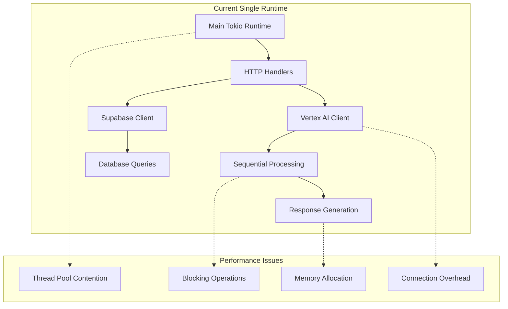
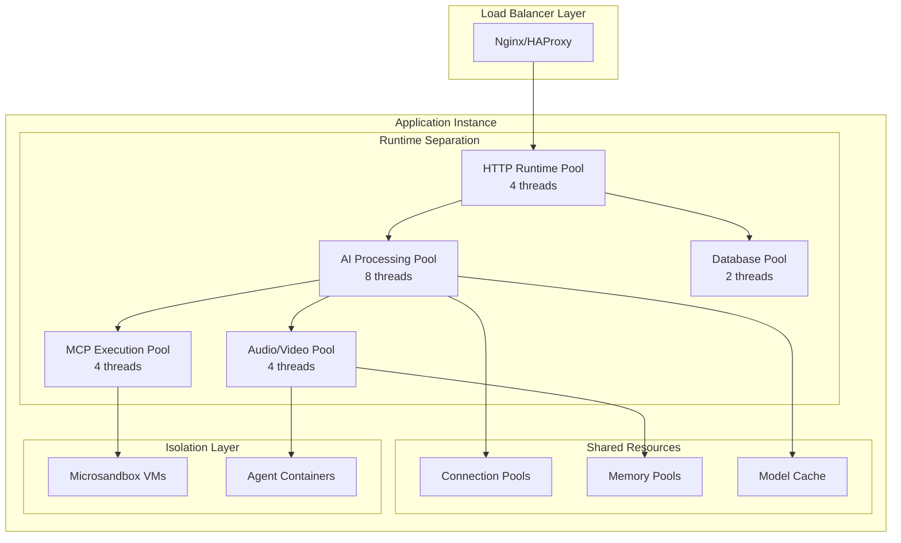

# High-Performance Threading Architecture

**Project:** llm-supabase-rs  
**Version:** 3.0 - Performance Optimized  
**Date:** October 3, 2025  
**Focus:** Real-Time AI Video Platform Preparation

---

## Executive Summary

This document outlines a comprehensive threading architecture designed to maximize throughput for the Universal AI Server Proxy, with specific focus on supporting the future Real-Time AI Video Platform requirements outlined in `REALTIME_AI_VIDEO.md`.

**Key Performance Targets:**
- **Concurrent requests:** 5,000+ (5x current target)
- **Agent join latency:** < 1s (50% improvement)
- **Transcription delay:** < 200ms (60% improvement)
- **End-to-end Q&A latency:** < 1s (50% improvement)
- **Concurrent LiveKit rooms:** 200+ (4x current target)

---

## Current Architecture Analysis

### Bottlenecks Identified



**Critical Issues:**
1. **Single Runtime Bottleneck**: All operations compete for the same thread pool
2. **Blocking Operations**: CPU-intensive tasks block I/O operations
3. **Connection Overhead**: No connection pooling or reuse
4. **Memory Inefficiency**: Excessive allocations in hot paths
5. **No Isolation**: MCP servers run in main process without sandboxing

---

## Proposed Threading Architecture

### Multi-Runtime Design



### Thread Pool Specialization

#### 1. HTTP Runtime Pool (4 threads)
- **Purpose**: Handle incoming HTTP requests and responses
- **Workload**: Request parsing, response serialization, middleware
- **Characteristics**: Low-latency, high-throughput I/O operations
- **Configuration**: Small stack size, optimized for network I/O

#### 2. AI Processing Pool (8 threads)
- **Purpose**: LLM inference, embedding generation, model operations
- **Workload**: Provider API calls, response conversion, tool orchestration
- **Characteristics**: Mixed I/O and CPU operations
- **Configuration**: Standard stack size, connection pooling

#### 3. Audio/Video Pool (4 threads)
- **Purpose**: Real-time audio/video processing for LiveKit integration
- **Workload**: Transcription, TTS, audio streaming, video processing
- **Characteristics**: Real-time, low-latency, high-priority
- **Configuration**: High priority, dedicated CPU cores, SIMD optimizations

#### 4. Database Pool (2 threads)
- **Purpose**: Database operations, webhook logging, audit trails
- **Workload**: PostgreSQL queries, connection management
- **Characteristics**: I/O bound with connection pooling
- **Configuration**: Connection pooling, prepared statements

#### 5. MCP Execution Pool (4 threads)
- **Purpose**: MCP server management and tool execution
- **Workload**: Microsandbox orchestration, tool calls, agent management
- **Characteristics**: Isolated execution, resource monitoring
- **Configuration**: Process management, resource limits

---

## Implementation Architecture

### Core Threading Components

```rust
// src/infrastructure/threading/mod.rs

use std::sync::Arc;
use tokio::runtime::{Builder, Runtime};
use tokio::sync::Semaphore;

pub struct ThreadingManager {
    /// HTTP request handling runtime
    pub http_runtime: Arc<Runtime>,
    
    /// AI processing runtime
    pub ai_runtime: Arc<Runtime>,
    
    /// Audio/Video processing runtime
    pub av_runtime: Arc<Runtime>,
    
    /// Database operations runtime
    pub db_runtime: Arc<Runtime>,
    
    /// MCP execution runtime
    pub mcp_runtime: Arc<Runtime>,
    
    /// Resource semaphores for backpressure
    pub http_semaphore: Arc<Semaphore>,
    pub ai_semaphore: Arc<Semaphore>,
    pub av_semaphore: Arc<Semaphore>,
}

impl ThreadingManager {
    pub fn new(config: &ThreadingConfig) -> anyhow::Result<Self> {
        // HTTP Runtime - optimized for I/O
        let http_runtime = Arc::new(
            Builder::new_multi_thread()
                .worker_threads(config.http_threads)
                .thread_name("http-worker")
                .thread_stack_size(2 * 1024 * 1024) // 2MB stack
                .enable_all()
                .build()?
        );
        
        // AI Processing Runtime - balanced I/O and CPU
        let ai_runtime = Arc::new(
            Builder::new_multi_thread()
                .worker_threads(config.ai_threads)
                .thread_name("ai-worker")
                .thread_stack_size(4 * 1024 * 1024) // 4MB stack
                .enable_all()
                .build()?
        );
        
        // Audio/Video Runtime - real-time optimized
        let av_runtime = Arc::new(
            Builder::new_multi_thread()
                .worker_threads(config.av_threads)
                .thread_name("av-worker")
                .thread_stack_size(8 * 1024 * 1024) // 8MB stack
                .enable_all()
                .build()?
        );
        
        // Database Runtime - I/O optimized
        let db_runtime = Arc::new(
            Builder::new_multi_thread()
                .worker_threads(config.db_threads)
                .thread_name("db-worker")
                .thread_stack_size(2 * 1024 * 1024) // 2MB stack
                .enable_io()
                .build()?
        );
        
        // MCP Runtime - process management
        let mcp_runtime = Arc::new(
            Builder::new_multi_thread()
                .worker_threads(config.mcp_threads)
                .thread_name("mcp-worker")
                .thread_stack_size(4 * 1024 * 1024) // 4MB stack
                .enable_all()
                .build()?
        );
        
        Ok(Self {
            http_runtime,
            ai_runtime,
            av_runtime,
            db_runtime,
            mcp_runtime,
            http_semaphore: Arc::new(Semaphore::new(config.max_concurrent_http)),
            ai_semaphore: Arc::new(Semaphore::new(config.max_concurrent_ai)),
            av_semaphore: Arc::new(Semaphore::new(config.max_concurrent_av)),
        })
    }
    
    /// Execute HTTP operation with backpressure
    pub async fn execute_http<F, T>(&self, operation: F) -> anyhow::Result<T>
    where
        F: Future<Output = anyhow::Result<T>> + Send + 'static,
        T: Send + 'static,
    {
        let _permit = self.http_semaphore.acquire().await?;
        
        self.http_runtime.spawn(operation).await?
    }
    
    /// Execute AI operation with dedicated runtime
    pub async fn execute_ai<F, T>(&self, operation: F) -> anyhow::Result<T>
    where
        F: Future<Output = anyhow::Result<T>> + Send + 'static,
        T: Send + 'static,
    {
        let _permit = self.ai_semaphore.acquire().await?;
        
        self.ai_runtime.spawn(operation).await?
    }
    
    /// Execute real-time audio/video operation
    pub async fn execute_realtime<F, T>(&self, operation: F) -> anyhow::Result<T>
    where
        F: Future<Output = anyhow::Result<T>> + Send + 'static,
        T: Send + 'static,
    {
        let _permit = self.av_semaphore.acquire().await?;
        
        self.av_runtime.spawn(operation).await?
    }
}

#[derive(Debug, Clone)]
pub struct ThreadingConfig {
    pub http_threads: usize,
    pub ai_threads: usize,
    pub av_threads: usize,
    pub db_threads: usize,
    pub mcp_threads: usize,
    pub max_concurrent_http: usize,
    pub max_concurrent_ai: usize,
    pub max_concurrent_av: usize,
}

impl Default for ThreadingConfig {
    fn default() -> Self {
        let cpu_count = num_cpus::get();
        
        Self {
            http_threads: (cpu_count / 4).max(2),
            ai_threads: (cpu_count / 2).max(4),
            av_threads: (cpu_count / 4).max(2),
            db_threads: 2,
            mcp_threads: (cpu_count / 4).max(2),
            max_concurrent_http: 1000,
            max_concurrent_ai: 100,
            max_concurrent_av: 50,
        }
    }
}
```

### Connection Pooling Architecture

```rust
// src/infrastructure/pools/mod.rs

use std::sync::Arc;
use tokio::sync::RwLock;
use dashmap::DashMap;

pub struct ConnectionManager {
    /// HTTP client pools per provider
    http_pools: DashMap<String, Arc<HttpClientPool>>,
    
    /// Database connection pool
    db_pool: Arc<DatabasePool>,
    
    /// WebSocket connection pools for real-time features
    ws_pools: Arc<RwLock<WebSocketPoolManager>>,
    
    /// Memory pools for zero-copy operations
    memory_pools: Arc<MemoryPoolManager>,
}

pub struct HttpClientPool {
    clients: Vec<reqwest::Client>,
    current_index: std::sync::atomic::AtomicUsize,
    pool_size: usize,
}

impl HttpClientPool {
    pub fn new(pool_size: usize, config: &HttpClientConfig) -> Self {
        let clients = (0..pool_size)
            .map(|_| {
                reqwest::Client::builder()
                    .timeout(config.timeout)
                    .pool_max_idle_per_host(config.max_idle_per_host)
                    .pool_idle_timeout(config.idle_timeout)
                    .tcp_keepalive(config.keepalive_duration)
                    .http2_prior_knowledge()
                    .build()
                    .expect("Failed to create HTTP client")
            })
            .collect();
            
        Self {
            clients,
            current_index: std::sync::atomic::AtomicUsize::new(0),
            pool_size,
        }
    }
    
    pub fn get_client(&self) -> &reqwest::Client {
        let index = self.current_index
            .fetch_add(1, std::sync::atomic::Ordering::Relaxed) 
            % self.pool_size;
        &self.clients[index]
    }
}

pub struct DatabasePool {
    pool: sqlx::PgPool,
    read_pool: sqlx::PgPool,  // Separate read replica pool
}

impl DatabasePool {
    pub async fn new(config: &DatabaseConfig) -> anyhow::Result<Self> {
        let pool = sqlx::postgres::PgPoolOptions::new()
            .max_connections(config.max_connections)
            .min_connections(config.min_connections)
            .acquire_timeout(config.acquire_timeout)
            .idle_timeout(config.idle_timeout)
            .max_lifetime(config.max_lifetime)
            .connect(&config.database_url)
            .await?;
            
        let read_pool = if let Some(read_url) = &config.read_replica_url {
            sqlx::postgres::PgPoolOptions::new()
                .max_connections(config.read_max_connections)
                .connect(read_url)
                .await?
        } else {
            pool.clone()
        };
        
        Ok(Self { pool, read_pool })
    }
    
    pub fn write_pool(&self) -> &sqlx::PgPool {
        &self.pool
    }
    
    pub fn read_pool(&self) -> &sqlx::PgPool {
        &self.read_pool
    }
}
```

### Memory Pool Management

```rust
// src/infrastructure/pools/memory.rs

use std::sync::Arc;
use tokio::sync::Mutex;
use bytes::{Bytes, BytesMut};

pub struct MemoryPoolManager {
    /// Audio buffer pools for real-time processing
    audio_buffers: Arc<Mutex<Vec<AudioBuffer>>>,
    
    /// Response buffer pools for HTTP responses
    response_buffers: Arc<Mutex<Vec<BytesMut>>>,
    
    /// Embedding buffer pools for vector operations
    embedding_buffers: Arc<Mutex<Vec<Vec<f32>>>>,
    
    /// Configuration
    config: MemoryPoolConfig,
}

pub struct AudioBuffer {
    data: Vec<f32>,
    capacity: usize,
    sample_rate: u32,
}

impl MemoryPoolManager {
    pub fn new(config: MemoryPoolConfig) -> Self {
        let audio_buffers = Arc::new(Mutex::new(
            (0..config.audio_buffer_count)
                .map(|_| AudioBuffer::new(config.audio_buffer_size, config.sample_rate))
                .collect()
        ));
        
        let response_buffers = Arc::new(Mutex::new(
            (0..config.response_buffer_count)
                .map(|_| BytesMut::with_capacity(config.response_buffer_size))
                .collect()
        ));
        
        let embedding_buffers = Arc::new(Mutex::new(
            (0..config.embedding_buffer_count)
                .map(|_| Vec::with_capacity(config.embedding_dimensions))
                .collect()
        ));
        
        Self {
            audio_buffers,
            response_buffers,
            embedding_buffers,
            config,
        }
    }
    
    /// Get audio buffer with zero-copy semantics
    pub async fn get_audio_buffer(&self) -> Option<AudioBuffer> {
        let mut buffers = self.audio_buffers.lock().await;
        buffers.pop()
    }
    
    /// Return audio buffer to pool
    pub async fn return_audio_buffer(&self, mut buffer: AudioBuffer) {
        buffer.clear();
        let mut buffers = self.audio_buffers.lock().await;
        if buffers.len() < self.config.audio_buffer_count {
            buffers.push(buffer);
        }
    }
}

#[derive(Debug, Clone)]
pub struct MemoryPoolConfig {
    pub audio_buffer_count: usize,
    pub audio_buffer_size: usize,
    pub sample_rate: u32,
    pub response_buffer_count: usize,
    pub response_buffer_size: usize,
    pub embedding_buffer_count: usize,
    pub embedding_dimensions: usize,
}

impl Default for MemoryPoolConfig {
    fn default() -> Self {
        Self {
            audio_buffer_count: 100,
            audio_buffer_size: 48000, // 1 second at 48kHz
            sample_rate: 48000,
            response_buffer_count: 200,
            response_buffer_size: 64 * 1024, // 64KB
            embedding_buffer_count: 50,
            embedding_dimensions: 1536,
        }
    }
}
```

---

## Real-Time Processing Pipeline

### Audio Processing Architecture

```mermaid
flowchart LR
    subgraph Input Sources
        A1[LiveKit Audio Stream]
        A2[WebRTC Audio]
        A3[File Upload]
        A4[Microphone Input]
    end
    
    subgraph Audio Processing Pipeline
        B1[Audio Buffer Pool]
        B2[Format Conversion]
        B3[Noise Reduction]
        B4[Voice Activity Detection]
        B5[Speaker Diarization]
    end
    
    subgraph Real-Time Transcription
        C1[Streaming STT Engine]
        C2[Transcript Chunking]
        C3[Confidence Scoring]
        C4[Real-Time Correction]
    end
    
    subgraph Knowledge Processing
        D1[Text Embedding]
        D2[Vector Storage]
        D3[Semantic Search]
        D4[Context Assembly]
    end
    
    subgraph Response Generation
        E1[LLM Processing]
        E2[Response Synthesis]
        E3[TTS Generation]
        E4[Audio Output]
    end
    
    A1 --> B1
    A2 --> B1
    A3 --> B2
    A4 --> B2
    
    B1 --> B2
    B2 --> B3
    B3 --> B4
    B4 --> B5
    
    B5 --> C1
    C1 --> C2
    C2 --> C3
    C3 --> C4
    
    C4 --> D1
    D1 --> D2
    D2 --> D3
    D3 --> D4
    
    D4 --> E1
    E1 --> E2
    E2 --> E3
    E3 --> E4
```



### Streaming Implementation

```rust
// src/infrastructure/streaming/realtime.rs

use tokio_stream::{Stream, StreamExt};
use std::pin::Pin;
use futures::Future;

pub struct RealTimeProcessor {
    threading_manager: Arc<ThreadingManager>,
    memory_pools: Arc<MemoryPoolManager>,
    transcription_engine: Arc<dyn TranscriptionEngine>,
    embedding_engine: Arc<dyn EmbeddingEngine>,
}

impl RealTimeProcessor {
    /// Process audio stream with zero-copy optimizations
    pub async fn process_audio_stream<S>(
        &self,
        audio_stream: S,
        session_id: Uuid,
    ) -> anyhow::Result<impl Stream<Item = ProcessedAudioChunk>>
    where
        S: Stream<Item = AudioChunk> + Send + 'static,
    {
        let processor = self.clone();
        
        Ok(audio_stream.then(move |chunk| {
            let processor = processor.clone();
            async move {
                processor.threading_manager
                    .execute_realtime(async move {
                        processor.process_audio_chunk(chunk, session_id).await
                    })
                    .await
            }
        }))
    }
    
    async fn process_audio_chunk(
        &self,
        chunk: AudioChunk,
        session_id: Uuid,
    ) -> anyhow::Result<ProcessedAudioChunk> {
        // Get buffer from pool
        let mut buffer = self.memory_pools
            .get_audio_buffer()
            .await
            .unwrap_or_else(|| AudioBuffer::new(48000, 48000));
        
        // Zero-copy audio processing
        buffer.load_from_chunk(&chunk)?;
        
        // Apply real-time audio processing
        let processed = self.apply_audio_processing(&mut buffer).await?;
        
        // Transcribe if voice activity detected
        let transcript = if processed.has_voice_activity {
            Some(self.transcription_engine
                .transcribe_realtime(&processed.audio_data)
                .await?)
        } else {
            None
        };
        
        // Return buffer to pool
        self.memory_pools.return_audio_buffer(buffer).await;
        
        Ok(ProcessedAudioChunk {
            session_id,
            timestamp: chunk.timestamp,
            transcript,
            confidence: processed.confidence,
            speaker_id: processed.speaker_id,
        })
    }
    
    async fn apply_audio_processing(
        &self,
        buffer: &mut AudioBuffer,
    ) -> anyhow::Result<ProcessedAudio> {
        // Use SIMD operations for audio processing
        #[cfg(target_arch = "x86_64")]
        {
            self.apply_simd_processing(buffer).await
        }
        #[cfg(not(target_arch = "x86_64"))]
        {
            self.apply_standard_processing(buffer).await
        }
    }
    
    #[cfg(target_arch = "x86_64")]
    async fn apply_simd_processing(
        &self,
        buffer: &mut AudioBuffer,
    ) -> anyhow::Result<ProcessedAudio> {
        use std::arch::x86_64::*;
        
        // SIMD-optimized noise reduction and voice activity detection
        // Implementation would use AVX2/AVX-512 instructions for performance
        
        Ok(ProcessedAudio {
            audio_data: buffer.data.clone(),
            has_voice_activity: true, // Placeholder
            confidence: 0.95,
            speaker_id: None,
        })
    }
}
```

---

## MCP Server Performance Optimization

### Microsandbox Integration

```rust
// src/infrastructure/mcp/sandbox_manager.rs

use std::collections::HashMap;
use std::sync::Arc;
use tokio::sync::{RwLock, Semaphore};
use tokio::process::{Child, Command};

pub struct SandboxManager {
    /// Active sandbox instances
    active_sandboxes: Arc<RwLock<HashMap<String, SandboxInstance>>>,
    
    /// Pre-warmed sandbox pool
    sandbox_pool: Arc<RwLock<Vec<SandboxInstance>>>,
    
    /// Resource limits
    resource_semaphore: Arc<Semaphore>,
    
    /// Configuration
    config: SandboxConfig,
}

pub struct SandboxInstance {
    id: String,
    process: Child,
    stdin: tokio::process::ChildStdin,
    stdout: tokio::process::ChildStdout,
    created_at: std::time::Instant,
    last_used: std::time::Instant,
    resource_usage: ResourceUsage,
}

#[derive(Debug, Clone)]
pub struct SandboxConfig {
    pub max_concurrent_sandboxes: usize,
    pub sandbox_timeout_ms: u64,
    pub memory_limit_mb: usize,
    pub cpu_limit_percent: f64,
    pub network_enabled: bool,
    pub prewarmed_instances: usize,
}

impl SandboxManager {
    pub async fn new(config: SandboxConfig) -> anyhow::Result<Self> {
        let manager = Self {
            active_sandboxes: Arc::new(RwLock::new(HashMap::new())),
            sandbox_pool: Arc::new(RwLock::new(Vec::new())),
            resource_semaphore: Arc::new(Semaphore::new(config.max_concurrent_sandboxes)),
            config,
        };
        
        // Pre-warm sandbox instances
        manager.prewarm_sandboxes().await?;
        
        // Start cleanup task
        tokio::spawn(manager.clone().cleanup_task());
        
        Ok(manager)
    }
    
    /// Get or create sandbox instance
    pub async fn get_sandbox(&self, server_name: &str) -> anyhow::Result<SandboxHandle> {
        let _permit = self.resource_semaphore.acquire().await?;
        
        // Check if already running
        {
            let active = self.active_sandboxes.read().await;
            if let Some(instance) = active.get(server_name) {
                return Ok(SandboxHandle::new(instance.clone(), _permit));
            }
        }
        
        // Try to get from pool
        let instance = {
            let mut pool = self.sandbox_pool.write().await;
            pool.pop()
        };
        
        let instance = if let Some(mut instance) = instance {
            // Reconfigure for specific server
            instance.reconfigure_for_server(server_name).await?;
            instance
        } else {
            // Create new instance
            self.create_sandbox_instance(server_name).await?
        };
        
        // Add to active instances
        {
            let mut active = self.active_sandboxes.write().await;
            active.insert(server_name.to_string(), instance.clone());
        }
        
        Ok(SandboxHandle::new(instance, _permit))
    }
    
    async fn create_sandbox_instance(&self, server_name: &str) -> anyhow::Result<SandboxInstance> {
        let mut cmd = Command::new("microsandbox");
        cmd.arg("run")
            .arg("--memory-limit").arg(format!("{}M", self.config.memory_limit_mb))
            .arg("--cpu-limit").arg(self.config.cpu_limit_percent.to_string())
            .arg("--timeout").arg(self.config.sandbox_timeout_ms.to_string());
            
        if !self.config.network_enabled {
            cmd.arg("--no-network");
        }
        
        // Add server-specific configuration
        cmd.arg("--").arg("mcp-server").arg(server_name);
        
        let mut process = cmd
            .stdin(std::process::Stdio::piped())
            .stdout(std::process::Stdio::piped())
            .stderr(std::process::Stdio::piped())
            .spawn()?;
            
        let stdin = process.stdin.take().unwrap();
        let stdout = process.stdout.take().unwrap();
        
        Ok(SandboxInstance {
            id: format!("{}_{}", server_name, uuid::Uuid::new_v4()),
            process,
            stdin,
            stdout,
            created_at: std::time::Instant::now(),
            last_used: std::time::Instant::now(),
            resource_usage: ResourceUsage::default(),
        })
    }
    
    /// Pre-warm sandbox instances for faster startup
    async fn prewarm_sandboxes(&self) -> anyhow::Result<()> {
        let mut pool = self.sandbox_pool.write().await;
        
        for i in 0..self.config.prewarmed_instances {
            let instance = self.create_sandbox_instance(&format!("prewarmed_{}", i)).await?;
            pool.push(instance);
        }
        
        tracing::info!("Pre-warmed {} sandbox instances", self.config.prewarmed_instances);
        Ok(())
    }
    
    /// Background cleanup task
    async fn cleanup_task(self) {
        let mut interval = tokio::time::interval(tokio::time::Duration::from_secs(30));
        
        loop {
            interval.tick().await;
            
            let mut active = self.active_sandboxes.write().await;
            let mut to_remove = Vec::new();
            
            for (name, instance) in active.iter() {
                if instance.last_used.elapsed() > tokio::time::Duration::from_secs(300) {
                    to_remove.push(name.clone());
                }
            }
            
            for name in to_remove {
                if let Some(mut instance) = active.remove(&name) {
                    // Gracefully shutdown sandbox
                    let _ = instance.process.kill().await;
                    tracing::debug!("Cleaned up inactive sandbox: {}", name);
                }
            }
        }
    }
}

pub struct SandboxHandle {
    instance: SandboxInstance,
    _permit: tokio::sync::SemaphorePermit<'_>,
}

impl SandboxHandle {
    fn new(instance: SandboxInstance, permit: tokio::sync::SemaphorePermit<'_>) -> Self {
        Self {
            instance,
            _permit: permit,
        }
    }
    
    pub async fn execute_tool(
        &mut self,
        tool_name: &str,
        arguments: serde_json::Value,
    ) -> anyhow::Result<serde_json::Value> {
        // Update last used timestamp
        self.instance.last_used = std::time::Instant::now();
        
        // Send MCP request
        let request = serde_json::json!({
            "jsonrpc": "2.0",
            "id": uuid::Uuid::new_v4().to_string(),
            "method": "tools/call",
            "params": {
                "name": tool_name,
                "arguments": arguments
            }
        });
        
        // Write to stdin
        use tokio::io::AsyncWriteExt;
        let request_bytes = serde_json::to_vec(&request)?;
        self.instance.stdin.write_all(&request_bytes).await?;
        self.instance.stdin.write_all(b"\n").await?;
        self.instance.stdin.flush().await?;
        
        // Read from stdout
        use tokio::io::{AsyncBufReadExt, BufReader};
        let mut reader = BufReader::new(&mut self.instance.stdout);
        let mut response_line = String::new();
        reader.read_line(&mut response_line).await?;
        
        // Parse response
        let response: serde_json::Value = serde_json::from_str(&response_line)?;
        
        if let Some(error) = response.get("error") {
            return Err(anyhow::anyhow!("MCP error: {}", error));
        }
        
        Ok(response.get("result").unwrap_or(&serde_json::Value::Null).clone())
    }
}
```

---

## Performance Monitoring

### Metrics Collection

```rust
// src/infrastructure/monitoring/metrics.rs

use prometheus::{
    Counter, Histogram, Gauge, IntCounter, IntGauge,
    register_counter, register_histogram, register_gauge,
    register_int_counter, register_int_gauge,
};
use std::sync::Arc;

pub struct PerformanceMetrics {
    // Threading metrics
    pub thread_pool_active: IntGauge,
    pub thread_pool_queue_size: IntGauge,
    pub thread_pool_utilization: Gauge,
    
    // Connection pool metrics
    pub connection_pool_active: IntGauge,
    pub connection_pool_idle: IntGauge,
    pub connection_pool_wait_time: Histogram,
    
    // Memory pool metrics
    pub memory_pool_usage: Gauge,
    pub memory_pool_allocations: IntCounter,
    pub memory_pool_deallocations: IntCounter,
    
    // Real-time processing